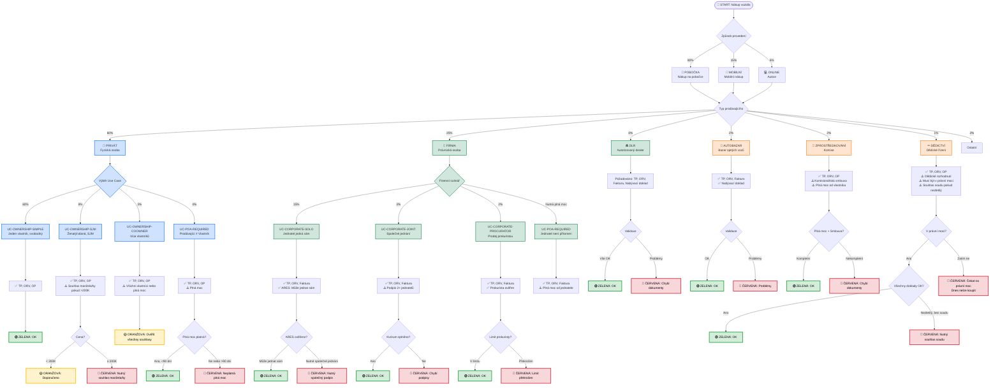

# Hlavní cesta nákupu vozidla - Rozhodovací strom

Kompletní rozhodovací strom od START → Identifikace typu prodávajícího → Výběr Use Case → Požadavky na dokumenty → Výsledek validace.

```mermaid
graph TB
    START([🚗 START: Nákup vozidla]) --> METHOD{Způsob provedení}

    METHOD -->|80%| POBOCKA[📍 POBOČKA<br/>Nákup na pobočce]
    METHOD -->|15%| MOBILNI[📱 MOBILNÍ<br/>Mobilní nákup]
    METHOD -->|5%| ONLINE[💻 ONLINE<br/>Aukce]

    POBOCKA --> VENDOR_TYPE
    MOBILNI --> VENDOR_TYPE
    ONLINE --> VENDOR_TYPE

    VENDOR_TYPE{Typ prodávajícího}

    %% Cesta fyzické osoby
    VENDOR_TYPE -->|60%| PRIVAT[👤 PRIVÁT<br/>Fyzická osoba]
    PRIVAT --> UC_PRIVAT{Výběr Use Case}

    UC_PRIVAT -->|60%| UC_SIMPLE[UC-OWNERSHIP-SIMPLE<br/>Jeden vlastník, svobodný]
    UC_PRIVAT -->|8%| UC_SJM[UC-OWNERSHIP-SJM<br/>Ženatý/vdaná, SJM]
    UC_PRIVAT -->|3%| UC_COOWNER[UC-OWNERSHIP-COOWNER<br/>Více vlastníků]
    UC_PRIVAT -->|4%| UC_POA[UC-POA-REQUIRED<br/>Prodávající ≠ Vlastník]

    %% Cesta firmy
    VENDOR_TYPE -->|25%| FIRMA[🏢 FIRMA<br/>Právnická osoba]
    FIRMA --> UC_FIRMA{Firemní scénář}

    UC_FIRMA -->|15%| UC_SOLO[UC-CORPORATE-SOLO<br/>Jednatel jedná sám]
    UC_FIRMA -->|3%| UC_JOINT[UC-CORPORATE-JOINT<br/>Společné jednání]
    UC_FIRMA -->|2%| UC_PROC[UC-CORPORATE-PROCURATOR<br/>Prodej prokuristou]
    UC_FIRMA -->|Nutná plná moc| UC_POA_CORP[UC-POA-REQUIRED<br/>Jednatel není přítomen]

    %% Cesta dealera
    VENDOR_TYPE -->|8%| DLR[🚘 DLR<br/>Autorizovaný dealer]
    DLR --> DOC_DLR[Požadováno: TP, ORV,<br/>Faktura, Nabývací doklad]
    DOC_DLR --> VAL_DLR{Validace}

    %% Ostatní prodejci
    VENDOR_TYPE -->|2%| AUTOBAZAR[🏪 AUTOBAZAR<br/>Bazar ojetých vozů]
    VENDOR_TYPE -->|2%| ZPROSTR[🤝 ZPROSTŘEDKOVÁNÍ<br/>Komise]
    VENDOR_TYPE -->|1%| DEDICTVI[⚰️ DĚDICTVÍ<br/>Dědické řízení]
    VENDOR_TYPE -->|2%| OTHER[Ostatní]

    %% Požadavky na dokumenty
    UC_SIMPLE --> DOC_CHECK_SIMPLE[✅ TP, ORV, OP]
    UC_SJM --> DOC_CHECK_SJM[✅ TP, ORV, OP<br/>⚠️ Souhlas manžela/ky pokud >200K]
    UC_COOWNER --> DOC_CHECK_CO[✅ TP, ORV, OP<br/>⚠️ Všichni vlastníci nebo plná moc]
    UC_POA --> DOC_CHECK_POA[✅ TP, ORV, OP<br/>⚠️ Plná moc]

    UC_SOLO --> DOC_CHECK_SOLO[✅ TP, ORV, Faktura<br/>✅ ARES: Může jednat sám]
    UC_JOINT --> DOC_CHECK_JOINT[✅ TP, ORV, Faktura<br/>⚠️ Podpis 2+ jednatelů]
    UC_PROC --> DOC_CHECK_PROC[✅ TP, ORV, Faktura<br/>✅ Prokurista ověřen]
    UC_POA_CORP --> DOC_CHECK_POA_CORP[✅ TP, ORV, Faktura<br/>⚠️ Plná moc od jednatele]

    AUTOBAZAR --> DOC_AB[✅ TP, ORV, Faktura<br/>✅ Nabývací doklad]
    ZPROSTR --> DOC_ZP[✅ TP, ORV, OP<br/>⚠️ Komisionářská smlouva<br/>⚠️ Plná moc od vlastníka]
    DEDICTVI --> DOC_DED[✅ TP, ORV, OP<br/>⚠️ Dědické rozhodnutí<br/>⚠️ Musí být v právní moci<br/>⚠️ Souhlas soudu pokud nezletilý]

    %% Výsledky validace
    DOC_CHECK_SIMPLE --> RESULT_GREEN1[🟢 ZELENÁ: OK]
    DOC_CHECK_SJM --> PRICE_CHECK{Cena?}
    PRICE_CHECK -->|< 200K| RESULT_ORANGE1[🟡 ORANŽOVÁ: Doporučeno]
    PRICE_CHECK -->|≥ 200K| RESULT_RED1[🔴 ČERVENÁ: Nutný souhlas manžela/ky]

    DOC_CHECK_CO --> RESULT_ORANGE2[🟡 ORANŽOVÁ: Ověřit všechny souhlasy]
    DOC_CHECK_POA --> POA_VALID{Plná moc platná?}
    POA_VALID -->|Ano, <90 dní| RESULT_GREEN2[🟢 ZELENÁ: OK]
    POA_VALID -->|Ne nebo >90 dní| RESULT_RED2[🔴 ČERVENÁ: Neplatná plná moc]

    DOC_CHECK_SOLO --> ARES_CHECK{ARES ověřeno?}
    ARES_CHECK -->|Může jednat sám| RESULT_GREEN3[🟢 ZELENÁ: OK]
    ARES_CHECK -->|Nutné společné jednání| RESULT_RED3[🔴 ČERVENÁ: Nutný společný podpis]

    DOC_CHECK_JOINT --> QUORUM{Kvórum splněno?}
    QUORUM -->|Ano| RESULT_GREEN4[🟢 ZELENÁ: OK]
    QUORUM -->|Ne| RESULT_RED4[🔴 ČERVENÁ: Chybí podpisy]

    DOC_CHECK_PROC --> PROC_LIMIT{Limit prokuristy?}
    PROC_LIMIT -->|V limitu| RESULT_GREEN5[🟢 ZELENÁ: OK]
    PROC_LIMIT -->|Překročen| RESULT_RED5[🔴 ČERVENÁ: Limit překročen]

    VAL_DLR -->|Vše OK| RESULT_GREEN6[🟢 ZELENÁ: OK]
    VAL_DLR -->|Problémy| RESULT_RED6[🔴 ČERVENÁ: Chybí dokumenty]

    DOC_AB --> VAL_AB{Validace}
    VAL_AB -->|OK| RESULT_GREEN7[🟢 ZELENÁ: OK]
    VAL_AB -->|Problémy| RESULT_RED7[🔴 ČERVENÁ: Problémy]

    DOC_ZP --> POA_ZP{Plná moc + Smlouva?}
    POA_ZP -->|Kompletní| RESULT_GREEN8[🟢 ZELENÁ: OK]
    POA_ZP -->|Nekompletní| RESULT_RED8[🔴 ČERVENÁ: Chybí dokumenty]

    DOC_DED --> LEGAL_FORCE{V právní moci?}
    LEGAL_FORCE -->|Ano| INHERIT_CHECK{Všechny doklady OK?}
    LEGAL_FORCE -->|Zatím ne| RESULT_RED_WAIT[🔴 ČERVENÁ: Čekat na právní moc<br/>Dnes nelze koupit]
    INHERIT_CHECK -->|Ano| RESULT_GREEN9[🟢 ZELENÁ: OK]
    INHERIT_CHECK -->|Nezletilý, bez soudu| RESULT_RED9[🔴 ČERVENÁ: Nutný souhlas soudu]

    %% Stylování
    classDef greenStatus fill:#d4edda,stroke:#28a745,stroke-width:3px,color:#000
    classDef orangeStatus fill:#fff3cd,stroke:#ffc107,stroke-width:3px,color:#000
    classDef redStatus fill:#f8d7da,stroke:#dc3545,stroke-width:3px,color:#000
    classDef privateStyle fill:#cfe2ff,stroke:#0d6efd,stroke-width:2px
    classDef corporateStyle fill:#d1e7dd,stroke:#198754,stroke-width:2px
    classDef specialStyle fill:#ffe5d0,stroke:#fd7e14,stroke-width:2px

    class RESULT_GREEN1,RESULT_GREEN2,RESULT_GREEN3,RESULT_GREEN4,RESULT_GREEN5,RESULT_GREEN6,RESULT_GREEN7,RESULT_GREEN8,RESULT_GREEN9 greenStatus
    class RESULT_ORANGE1,RESULT_ORANGE2 orangeStatus
    class RESULT_RED1,RESULT_RED2,RESULT_RED3,RESULT_RED4,RESULT_RED5,RESULT_RED6,RESULT_RED7,RESULT_RED8,RESULT_RED9,RESULT_RED_WAIT redStatus
    class PRIVAT,UC_PRIVAT,UC_SIMPLE,UC_SJM,UC_COOWNER,UC_POA privateStyle
    class FIRMA,UC_FIRMA,UC_SOLO,UC_JOINT,UC_PROC,UC_POA_CORP,DLR corporateStyle
    class DEDICTVI,ZPROSTR,AUTOBAZAR specialStyle
```
