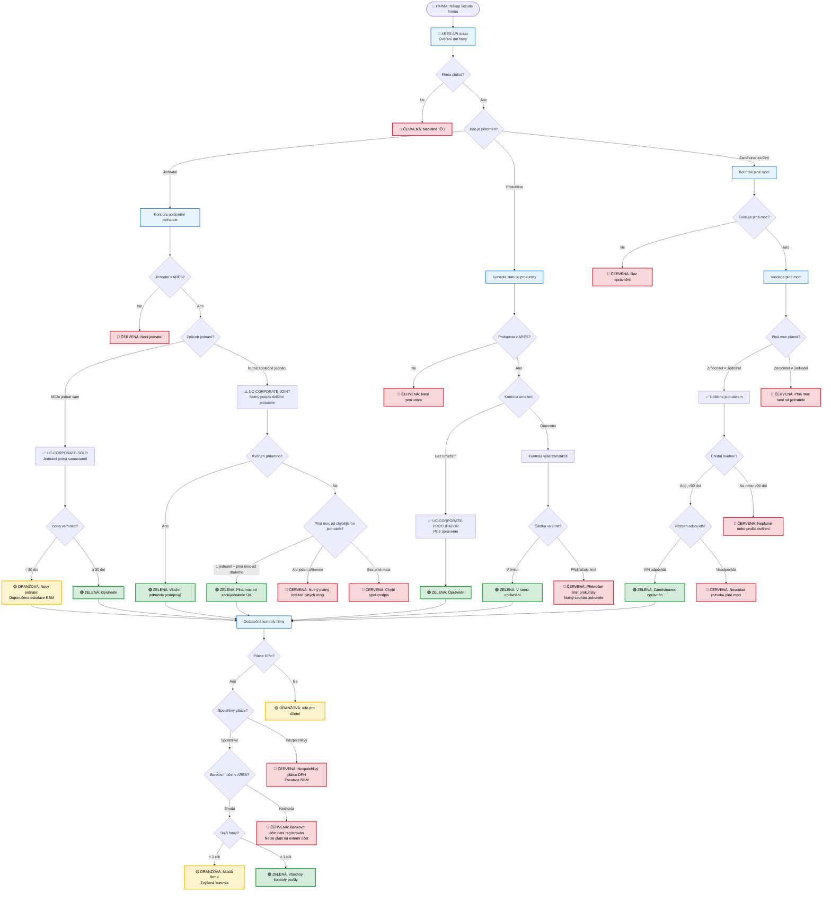

# Firma (FIRMA) - Detailní pohled na firemní scénáře

Detailní tok pro právnické osoby včetně ověření ARES, autorizace jednatele/prokuristy a zpracování plné moci zaměstnance.

```mermaid
graph TB
    START_CORP([🏢 FIRMA: Nákup vozidla firmou]) --> ARES_LOOKUP[📡 ARES API dotaz<br/>Ověření dat firmy]

    ARES_LOOKUP --> VALID_COMPANY{Firma platná?}
    VALID_COMPANY -->|Ne| RED1[🔴 ČERVENÁ: Neplatné IČO]
    VALID_COMPANY -->|Ano| CHECK_REP{Kdo je přítomen?}

    CHECK_REP -->|Jednatel| DIR_CHECK[Kontrola oprávnění jednatele]
    CHECK_REP -->|Prokurista| PROC_CHECK[Kontrola statusu prokuristy]
    CHECK_REP -->|Zaměstnanec/Jiný| EMP_CHECK[Kontrola plné moci]

    %% Cesta jednatele
    DIR_CHECK --> DIR_VERIFIED{Jednatel v ARES?}
    DIR_VERIFIED -->|Ne| RED2[🔴 ČERVENÁ: Není jednatel]
    DIR_VERIFIED -->|Ano| DIR_MODE{Způsob jednání?}

    DIR_MODE -->|Může jednat sám| DIR_ALONE[✅ UC-CORPORATE-SOLO<br/>Jednatel jedná samostatně]
    DIR_MODE -->|Nutné společné jednání| DIR_JOINT[⚠️ UC-CORPORATE-JOINT<br/>Nutný podpis dalšího jednatele]

    DIR_ALONE --> AGE_CHECK{Doba ve funkci?}
    AGE_CHECK -->|< 30 dní| ORANGE1[🟡 ORANŽOVÁ: Nový jednatel<br/>Doporučena eskalace RBM]
    AGE_CHECK -->|≥ 30 dní| GREEN1[🟢 ZELENÁ: Oprávněn]

    DIR_JOINT --> QUORUM_CHECK{Kvórum přítomno?}
    QUORUM_CHECK -->|Ano| GREEN2[🟢 ZELENÁ: Všichni jednatelé podepisují]
    QUORUM_CHECK -->|Ne| POA_OPT1{Plná moc od chybějícího jednatele?}
    POA_OPT1 -->|1 jednatel + plná moc od druhého| GREEN3[🟢 ZELENÁ: Plná moc od spolujednatele OK]
    POA_OPT1 -->|Ani jeden přítomen| RED3A[🔴 ČERVENÁ: Nutný platný řetězec plných mocí]
    POA_OPT1 -->|Bez plné moci| RED3[🔴 ČERVENÁ: Chybí spolupodpis]

    %% Cesta prokuristy
    PROC_CHECK --> PROC_VERIFIED{Prokurista v ARES?}
    PROC_VERIFIED -->|Ne| RED4[🔴 ČERVENÁ: Není prokurista]
    PROC_VERIFIED -->|Ano| PROC_LIMIT{Kontrola omezení}

    PROC_LIMIT -->|Bez omezení| PROC_FULL[✅ UC-CORPORATE-PROCURATOR<br/>Plné oprávnění]
    PROC_LIMIT -->|Omezeno| PROC_LIMITED[Kontrola výše transakce]

    PROC_LIMITED --> AMOUNT_CHECK{Částka vs Limit?}
    AMOUNT_CHECK -->|V limitu| GREEN4[🟢 ZELENÁ: V rámci oprávnění]
    AMOUNT_CHECK -->|Překračuje limit| RED5[🔴 ČERVENÁ: Překročen limit prokuristy<br/>Nutný souhlas jednatele]

    PROC_FULL --> GREEN5[🟢 ZELENÁ: Oprávněn]

    %% Cesta zaměstnance
    EMP_CHECK --> POA_EXISTS{Existuje plná moc?}
    POA_EXISTS -->|Ne| RED6[🔴 ČERVENÁ: Bez oprávnění]
    POA_EXISTS -->|Ano| POA_VALIDATE[Validace plné moci]

    POA_VALIDATE --> POA_CHECKS{Plná moc platná?}
    POA_CHECKS -->|Zmocnitel = Jednatel| POA_OK1[✅ Udělena jednatelem]
    POA_CHECKS -->|Zmocnitel ≠ Jednatel| RED7[🔴 ČERVENÁ: Plná moc není od jednatele]

    POA_OK1 --> POA_STAMP{Úřední ověření?}
    POA_STAMP -->|Ano, <90 dní| POA_SCOPE{Rozsah odpovídá?}
    POA_STAMP -->|Ne nebo >90 dní| RED8[🔴 ČERVENÁ: Neplatné nebo prošlé ověření]

    POA_SCOPE -->|VIN odpovídá| GREEN6[🟢 ZELENÁ: Zaměstnanec oprávněn]
    POA_SCOPE -->|Neodpovídá| RED9[🔴 ČERVENÁ: Nesoulad rozsahu plné moci]

    %% Dodatečné kontroly firmy
    GREEN1 --> FINAL_CHECKS
    GREEN2 --> FINAL_CHECKS
    GREEN3 --> FINAL_CHECKS
    GREEN4 --> FINAL_CHECKS
    GREEN5 --> FINAL_CHECKS
    GREEN6 --> FINAL_CHECKS
    ORANGE1 --> FINAL_CHECKS

    FINAL_CHECKS[Dodatečné kontroly firmy]
    FINAL_CHECKS --> VAT_CHECK{Plátce DPH?}
    VAT_CHECK -->|Ano| VAT_STATUS{Spolehlivý plátce?}
    VAT_CHECK -->|Ne| ORANGE2[🟡 ORANŽOVÁ: Info pro účetní]

    VAT_STATUS -->|Spolehlivý| BANK_CHECK{Bankovní účet v ARES?}
    VAT_STATUS -->|Nespolehlivý| RED10[🔴 ČERVENÁ: Nespolehlivý plátce DPH<br/>Eskalace RBM]

    BANK_CHECK -->|Shoda| COMPANY_AGE{Stáří firmy?}
    BANK_CHECK -->|Neshoda| RED11[🔴 ČERVENÁ: Bankovní účet není registrován<br/>Nelze platit na externí účet]

    COMPANY_AGE -->|< 1 rok| ORANGE3[🟡 ORANŽOVÁ: Mladá firma<br/>Zvýšená kontrola]
    COMPANY_AGE -->|≥ 1 rok| FINAL_GREEN[🟢 ZELENÁ: Všechny kontroly prošly]

    %% Stylování
    classDef greenStatus fill:#d4edda,stroke:#28a745,stroke-width:3px,color:#000
    classDef orangeStatus fill:#fff3cd,stroke:#ffc107,stroke-width:3px,color:#000
    classDef redStatus fill:#f8d7da,stroke:#dc3545,stroke-width:3px,color:#000
    classDef processStyle fill:#e7f3ff,stroke:#0969da,stroke-width:2px

    class GREEN1,GREEN2,GREEN3,GREEN4,GREEN5,GREEN6,FINAL_GREEN greenStatus
    class ORANGE1,ORANGE2,ORANGE3 orangeStatus
    class RED1,RED2,RED3,RED3A,RED4,RED5,RED6,RED7,RED8,RED9,RED10,RED11 redStatus
    class ARES_LOOKUP,DIR_CHECK,PROC_CHECK,EMP_CHECK,POA_VALIDATE,FINAL_CHECKS processStyle
```
