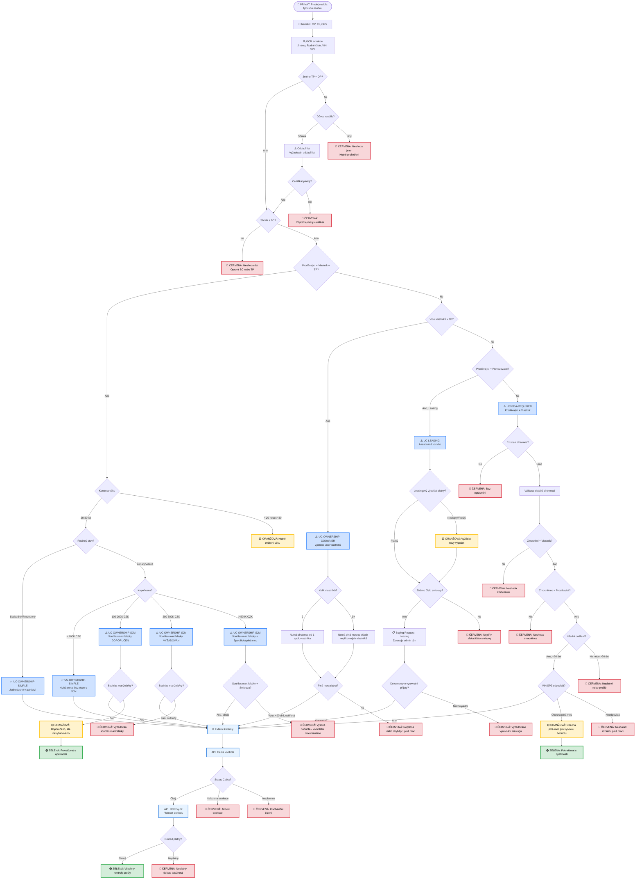

# Fyzická osoba (PRIVÁT) - Scénáře

Všechny scénáře pro fyzické osoby včetně SJM (společné jmění manželů), validace plné moci a externích kontrol.

```mermaid
graph TB
    START_PRIV([👤 PRIVÁT: Prodej vozidla fyzickou osobou]) --> DOC_UPLOAD[📄 Nahrání: OP, TP, ORV]

    DOC_UPLOAD --> OCR_EXTRACT[🔍 OCR extrakce<br/>Jméno, Rodné číslo, VIN, SPZ]
    OCR_EXTRACT --> NAME_MATCH{Jméno TP = OP?}

    %% Validace změny jména (Oddací list)
    NAME_MATCH -->|Ano| MATCH_BC{Shoda s BC?}
    NAME_MATCH -->|Ne| NAME_CHANGE{Důvod rozdílu?}
    NAME_CHANGE -->|Sňatek| DOC_MARRIAGE[⚠️ Oddací list<br/>Vyžadován oddací list]
    NAME_CHANGE -->|Jiný| RED_NAME[🔴 ČERVENÁ: Neshoda jmen<br/>Nutné prošetření]
    DOC_MARRIAGE --> CERT_VALID{Certifikát platný?}
    CERT_VALID -->|Ano| MATCH_BC
    CERT_VALID -->|Ne| RED_CERT[🔴 ČERVENÁ: Chybí/neplatný certifikát]

    MATCH_BC -->|Ne| RED1[🔴 ČERVENÁ: Neshoda dat<br/>Opravit BC nebo TP]
    MATCH_BC -->|Ano| OWNER_CHECK{Prodávající = Vlastník v TP?}

    %% Cesta vlastníka přítomného
    OWNER_CHECK -->|Ano| AGE_CHECK{Kontrola věku}
    AGE_CHECK -->|20-80 let| MARITAL_STATUS{Rodinný stav?}
    AGE_CHECK -->|< 20 nebo > 80| ORANGE1[🟡 ORANŽOVÁ: Nutné ověření věku]

    MARITAL_STATUS -->|Svobodný/Rozvedený| UC_SIMPLE[✅ UC-OWNERSHIP-SIMPLE<br/>Jednoduché vlastnictví]
    MARITAL_STATUS -->|Ženatý/Vdaná| PRICE_CHECK{Kupní cena?}

    PRICE_CHECK -->|< 100K CZK| UC_SIMPLE_LOW[✅ UC-OWNERSHIP-SIMPLE<br/>Nízká cena, bez obav o SJM]
    PRICE_CHECK -->|100-200K CZK| UC_SJM_MED[⚠️ UC-OWNERSHIP-SJM<br/>Souhlas manžela/ky DOPORUČEN]
    PRICE_CHECK -->|200-500K CZK| UC_SJM_HIGH[⚠️ UC-OWNERSHIP-SJM<br/>Souhlas manžela/ky VYŽADOVÁN]
    PRICE_CHECK -->|> 500K CZK| UC_SJM_VHIGH[⚠️ UC-OWNERSHIP-SJM<br/>Souhlas manžela/ky + Specifická plná moc]

    UC_SIMPLE --> EXTERNAL_CHECKS
    UC_SIMPLE_LOW --> EXTERNAL_CHECKS

    UC_SJM_MED --> SPOUSE_CONSENT1{Souhlas manžela/ky?}
    SPOUSE_CONSENT1 -->|Ano| EXTERNAL_CHECKS
    SPOUSE_CONSENT1 -->|Ne| ORANGE2[🟡 ORANŽOVÁ: Doporučeno, ale nevyžadováno]

    UC_SJM_HIGH --> SPOUSE_CONSENT2{Souhlas manžela/ky?}
    SPOUSE_CONSENT2 -->|Ano, ověřený| EXTERNAL_CHECKS
    SPOUSE_CONSENT2 -->|Ne| RED2[🔴 ČERVENÁ: Vyžadován souhlas manžela/ky]

    UC_SJM_VHIGH --> SPOUSE_CONSENT3{Souhlas manžela/ky + Smlouva?}
    SPOUSE_CONSENT3 -->|Ano, oboje| EXTERNAL_CHECKS
    SPOUSE_CONSENT3 -->|Ne| RED3[🔴 ČERVENÁ: Vysoká hodnota - kompletní dokumentace]

    %% Cesta vlastníka nepřítomného
    OWNER_CHECK -->|Ne| MULTI_OWNER{Více vlastníků v TP?}

    MULTI_OWNER -->|Ano| UC_COOWNER[⚠️ UC-OWNERSHIP-COOWNER<br/>Zjištěno více vlastníků]
    MULTI_OWNER -->|Ne| OPERATOR_CHECK{Prodávající = Provozovatel?}

    UC_COOWNER --> COOWNER_COUNT{Kolik vlastníků?}
    COOWNER_COUNT -->|2| POA_2[Nutná plná moc od 1 spoluvlastníka]
    COOWNER_COUNT -->|3+| POA_ALL[Nutná plná moc od všech nepřítomných vlastníků]

    POA_2 --> POA_VALID1{Plná moc platná?}
    POA_ALL --> POA_VALID1
    POA_VALID1 -->|Ano, <90 dní, ověřená| EXTERNAL_CHECKS
    POA_VALID1 -->|Ne| RED4[🔴 ČERVENÁ: Neplatná nebo chybějící plná moc]

    OPERATOR_CHECK -->|Ano, Leasing| UC_LEASING[⚠️ UC-LEASING<br/>Leasované vozidlo]
    OPERATOR_CHECK -->|Ne| UC_POA_REQ[⚠️ UC-POA-REQUIRED<br/>Prodávající ≠ Vlastník]

    UC_LEASING --> LEASE_CALC{Leasingový výpočet platný?}
    LEASE_CALC -->|Platný| LEASE_CONTRACT{Známo číslo smlouvy?}
    LEASE_CALC -->|Neplatný/Prošlý| ORANGE_LEASE[🟡 ORANŽOVÁ: Vyžádat nový výpočet]
    LEASE_CONTRACT -->|Ano| BUYING_REQ[📋 Buying Request - Leasing<br/>Zpracuje admin tým]
    LEASE_CONTRACT -->|Ne| RED_CONTRACT[🔴 ČERVENÁ: Nejdřív získat číslo smlouvy]
    BUYING_REQ --> LEASING_DOCS{Dokumenty o vyrovnání přijaty?}
    ORANGE_LEASE --> LEASE_CONTRACT
    LEASING_DOCS -->|Kompletní| EXTERNAL_CHECKS
    LEASING_DOCS -->|Nekompletní| RED5[🔴 ČERVENÁ: Vyžadováno vyrovnání leasingu]

    UC_POA_REQ --> POA_CHECK{Existuje plná moc?}
    POA_CHECK -->|Ne| RED6[🔴 ČERVENÁ: Bez oprávnění]
    POA_CHECK -->|Ano| POA_DETAILS[Validace detailů plné moci]

    POA_DETAILS --> POA_GRANTOR{Zmocnitel = Vlastník?}
    POA_GRANTOR -->|Ne| RED7[🔴 ČERVENÁ: Neshoda zmocnitele]
    POA_GRANTOR -->|Ano| POA_AGENT{Zmocněnec = Prodávající?}

    POA_AGENT -->|Ne| RED8[🔴 ČERVENÁ: Neshoda zmocněnce]
    POA_AGENT -->|Ano| POA_STAMP_CHECK{Úřední ověření?}

    POA_STAMP_CHECK -->|Ano, <90 dní| POA_SCOPE{VIN/SPZ odpovídá?}
    POA_STAMP_CHECK -->|Ne nebo >90 dní| RED9[🔴 ČERVENÁ: Neplatné nebo prošlé]

    POA_SCOPE -->|Ano| EXTERNAL_CHECKS
    POA_SCOPE -->|Obecná plná moc| ORANGE3[🟡 ORANŽOVÁ: Obecná plná moc pro vysokou hodnotu]
    POA_SCOPE -->|Neodpovídá| RED10[🔴 ČERVENÁ: Nesoulad rozsahu plné moci]

    %% Externí validace
    EXTERNAL_CHECKS[🌐 Externí kontroly]
    EXTERNAL_CHECKS --> CEBIA[API: Cebia kontrola]

    CEBIA --> CEBIA_RESULT{Status Cebia?}
    CEBIA_RESULT -->|Čistý| DOLOZKY[API: Doložky.cz<br/>Platnost dokladu]
    CEBIA_RESULT -->|Nalezena exekuce| RED11[🔴 ČERVENÁ: Aktivní exekuce]
    CEBIA_RESULT -->|Insolvence| RED12[🔴 ČERVENÁ: Insolvenční řízení]

    DOLOZKY --> DOLOZKY_RESULT{Doklad platný?}
    DOLOZKY_RESULT -->|Platný| GREEN1[🟢 ZELENÁ: Všechny kontroly prošly]
    DOLOZKY_RESULT -->|Neplatný| RED13[🔴 ČERVENÁ: Neplatný doklad totožnosti]

    ORANGE2 --> GREEN2[🟢 ZELENÁ: Pokračovat s opatrností]
    ORANGE3 --> GREEN3[🟢 ZELENÁ: Pokračovat s opatrností]

    %% Stylování
    classDef greenStatus fill:#d4edda,stroke:#28a745,stroke-width:3px,color:#000
    classDef orangeStatus fill:#fff3cd,stroke:#ffc107,stroke-width:3px,color:#000
    classDef redStatus fill:#f8d7da,stroke:#dc3545,stroke-width:3px,color:#000
    classDef ucStyle fill:#cfe2ff,stroke:#0d6efd,stroke-width:2px
    classDef checkStyle fill:#e7f3ff,stroke:#0969da,stroke-width:2px

    class GREEN1,GREEN2,GREEN3 greenStatus
    class ORANGE1,ORANGE2,ORANGE3,ORANGE_LEASE orangeStatus
    class RED1,RED2,RED3,RED4,RED5,RED6,RED7,RED8,RED9,RED10,RED11,RED12,RED13,RED_NAME,RED_CERT,RED_CONTRACT redStatus
    class UC_SIMPLE,UC_SIMPLE_LOW,UC_SJM_MED,UC_SJM_HIGH,UC_SJM_VHIGH,UC_COOWNER,UC_LEASING,UC_POA_REQ ucStyle
    class EXTERNAL_CHECKS,CEBIA,DOLOZKY checkStyle
```
