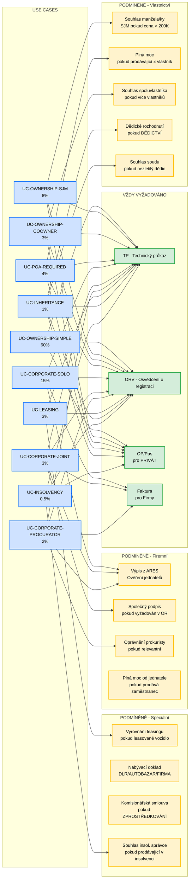

# Matice požadavků na dokumenty podle Use Case

Vizuální mapování, které dokumenty jsou vyžadovány pro jednotlivé use case a scénáře.

```mermaid
graph LR
    subgraph "VŽDY VYŽADOVÁNO"
        A1[TP - Technický průkaz]
        A2[ORV - Osvědčení o registraci]
        A3[OP/Pas<br/>pro PRIVÁT]
        A4[Faktura<br/>pro Firmy]
    end

    subgraph "PODMÍNĚNĚ - Vlastnictví"
        B1[Souhlas manžela/ky<br/>SJM pokud cena > 200K]
        B2[Plná moc<br/>pokud prodávající ≠ vlastník]
        B3[Souhlas spoluvlastníka<br/>pokud více vlastníků]
        B4[Dědické rozhodnutí<br/>pokud DĚDICTVÍ]
        B5[Souhlas soudu<br/>pokud nezletilý dědic]
    end

    subgraph "PODMÍNĚNĚ - Firemní"
        C1[Výpis z ARES<br/>Ověření jednatelů]
        C2[Společný podpis<br/>pokud vyžadován v OR]
        C3[Oprávnění prokuristy<br/>pokud relevantní]
        C4[Plná moc od jednatele<br/>pokud prodává zaměstnanec]
    end

    subgraph "PODMÍNĚNĚ - Speciální"
        D1[Vyrovnání leasingu<br/>pokud leasované vozidlo]
        D2[Nabývací doklad<br/>DLR/AUTOBAZAR/FIRMA]
        D3[Komisionářská smlouva<br/>pokud ZPROSTŘEDKOVÁNÍ]
        D4[Souhlas insol. správce<br/>pokud prodávající v insolvenci]
    end

    subgraph "USE CASES"
        UC1[UC-OWNERSHIP-SIMPLE<br/>60%]
        UC2[UC-OWNERSHIP-SJM<br/>8%]
        UC3[UC-OWNERSHIP-COOWNER<br/>3%]
        UC4[UC-POA-REQUIRED<br/>4%]
        UC5[UC-CORPORATE-SOLO<br/>15%]
        UC6[UC-CORPORATE-JOINT<br/>3%]
        UC7[UC-CORPORATE-PROCURATOR<br/>2%]
        UC8[UC-LEASING<br/>3%]
        UC9[UC-INHERITANCE<br/>1%]
        UC10[UC-INSOLVENCY<br/>0.5%]
    end

    %% Propojení - PRIVÁT
    UC1 --> A1 & A2 & A3

    UC2 --> A1 & A2 & A3
    UC2 --> B1

    UC3 --> A1 & A2 & A3
    UC3 --> B3

    UC4 --> A1 & A2 & A3
    UC4 --> B2

    %% Propojení - FIREMNÍ
    UC5 --> A1 & A2 & A4
    UC5 --> C1

    UC6 --> A1 & A2 & A4
    UC6 --> C1 & C2

    UC7 --> A1 & A2 & A4
    UC7 --> C1 & C3

    %% Propojení - SPECIÁLNÍ
    UC8 --> A1 & A2
    UC8 --> D1

    UC9 --> A1 & A2 & A3
    UC9 --> B4 & B5

    UC10 --> A1 & A2 & A3
    UC10 --> D4

    %% Stylování
    classDef alwaysDoc fill:#d4edda,stroke:#28a745,stroke-width:2px,color:#000
    classDef conditionalDoc fill:#fff3cd,stroke:#ffc107,stroke-width:2px,color:#000
    classDef ucDoc fill:#cfe2ff,stroke:#0d6efd,stroke-width:2px,color:#000

    class A1,A2,A3,A4 alwaysDoc
    class B1,B2,B3,B4,B5,C1,C2,C3,C4,D1,D2,D3,D4 conditionalDoc
    class UC1,UC2,UC3,UC4,UC5,UC6,UC7,UC8,UC9,UC10 ucDoc
```
