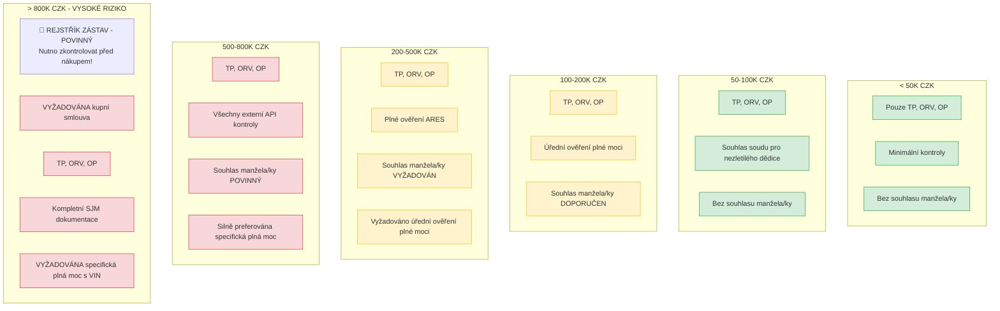

# Vliv cenových prahů

Vizuální znázornění, jak kupní cena ovlivňuje požadavky na dokumenty.

```mermaid
graph TD
    subgraph "< 50K CZK"
        P1_DOCS[Pouze TP, ORV, OP]
        P1_CHECK[Minimální kontroly]
        P1_SJM[Bez souhlasu manžela/ky]
    end

    subgraph "50-100K CZK"
        P2_DOCS[TP, ORV, OP]
        P2_CHECK[Souhlas soudu pro nezletilého dědice]
        P2_SJM[Bez souhlasu manžela/ky]
    end

    subgraph "100-200K CZK"
        P3_DOCS[TP, ORV, OP]
        P3_CHECK[Úřední ověření plné moci]
        P3_SJM[Souhlas manžela/ky DOPORUČEN]
    end

    subgraph "200-500K CZK"
        P4_DOCS[TP, ORV, OP]
        P4_CHECK[Plné ověření ARES]
        P4_SJM[Souhlas manžela/ky VYŽADOVÁN]
        P4_POA[Vyžadováno úřední ověření plné moci]
    end

    subgraph "500-800K CZK"
        P5_DOCS[TP, ORV, OP]
        P5_CHECK[Všechny externí API kontroly]
        P5_SJM[Souhlas manžela/ky POVINNÝ]
        P5_POA[Silně preferována specifická plná moc]
    end

    subgraph "> 800K CZK - VYSOKÉ RIZIKO"
        P6_PLEDGE[🔴 REJSTŘÍK ZÁSTAV - POVINNÝ<br/>Nutno zkontrolovat před nákupem!]
        P6_CHECK[VYŽADOVÁNA kupní smlouva]
        P6_DOCS[TP, ORV, OP]
        P6_SJM[Kompletní SJM dokumentace]
        P6_POA[VYŽADOVÁNA specifická plná moc s VIN]
    end

    %% Stylování
    classDef lowTier fill:#d4edda,stroke:#28a745
    classDef medTier fill:#fff3cd,stroke:#ffc107
    classDef highTier fill:#f8d7da,stroke:#dc3545

    class P1_DOCS,P1_CHECK,P1_SJM,P2_DOCS,P2_CHECK,P2_SJM lowTier
    class P3_DOCS,P3_CHECK,P3_SJM,P4_DOCS,P4_CHECK,P4_SJM,P4_POA medTier
    class P5_DOCS,P5_CHECK,P5_SJM,P5_POA,P6_DOCS,P6_CHECK,P6_SJM,P6_POA highTier
    class P6_PLEDGE fill:#dc3545,stroke:#721c24,stroke-width:3px,color:#fff
```
