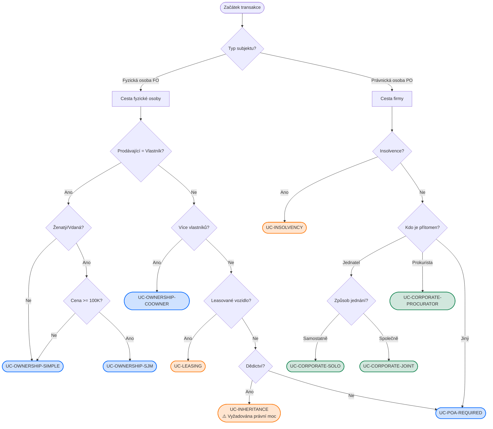

# Rozhodovací strom pro výběr Use Case

Zjednodušený rozhodovací strom pro výběr správného use case na základě charakteristik transakce.

```mermaid
graph TD
    START([Začátek transakce]) --> ENTITY{Typ subjektu?}

    ENTITY -->|Fyzická osoba FO| FO_PATH[Cesta fyzické osoby]
    ENTITY -->|Právnická osoba PO| PO_PATH[Cesta firmy]

    %% Cesta FO
    FO_PATH --> FO_OWNER{Prodávající = Vlastník?}
    FO_OWNER -->|Ano| FO_MARRIED{Ženatý/Vdaná?}
    FO_OWNER -->|Ne| FO_MULTI{Více vlastníků?}

    FO_MARRIED -->|Ne| UC_SIMPLE([UC-OWNERSHIP-SIMPLE])
    FO_MARRIED -->|Ano| FO_PRICE{Cena >= 100K?}

    FO_PRICE -->|Ne| UC_SIMPLE
    FO_PRICE -->|Ano| UC_SJM([UC-OWNERSHIP-SJM])

    FO_MULTI -->|Ano| UC_COOWNER([UC-OWNERSHIP-COOWNER])
    FO_MULTI -->|Ne| FO_LEASING{Leasované vozidlo?}

    FO_LEASING -->|Ano| UC_LEASING([UC-LEASING])
    FO_LEASING -->|Ne| FO_INHERIT{Dědictví?}

    FO_INHERIT -->|Ano| UC_INHERIT([UC-INHERITANCE<br/>⚠️ Vyžadována právní moc])
    FO_INHERIT -->|Ne| UC_POA([UC-POA-REQUIRED])

    %% Cesta PO
    PO_PATH --> PO_INSOLV{Insolvence?}
    PO_INSOLV -->|Ano| UC_INSOLV([UC-INSOLVENCY])
    PO_INSOLV -->|Ne| PO_REP{Kdo je přítomen?}

    PO_REP -->|Jednatel| PO_ACTION{Způsob jednání?}
    PO_REP -->|Prokurista| UC_PROC([UC-CORPORATE-PROCURATOR])
    PO_REP -->|Jiný| UC_POA

    PO_ACTION -->|Samostatně| UC_SOLO([UC-CORPORATE-SOLO])
    PO_ACTION -->|Společně| UC_JOINT([UC-CORPORATE-JOINT])

    %% Stylování
    classDef ucPrivate fill:#cfe2ff,stroke:#0d6efd,stroke-width:2px
    classDef ucCorporate fill:#d1e7dd,stroke:#198754,stroke-width:2px
    classDef ucSpecial fill:#ffe5d0,stroke:#fd7e14,stroke-width:2px

    class UC_SIMPLE,UC_SJM,UC_COOWNER,UC_POA ucPrivate
    class UC_SOLO,UC_JOINT,UC_PROC ucCorporate
    class UC_LEASING,UC_INHERIT,UC_INSOLV ucSpecial
```
