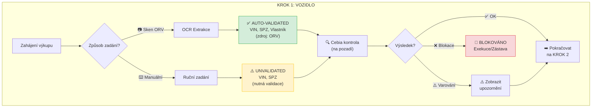
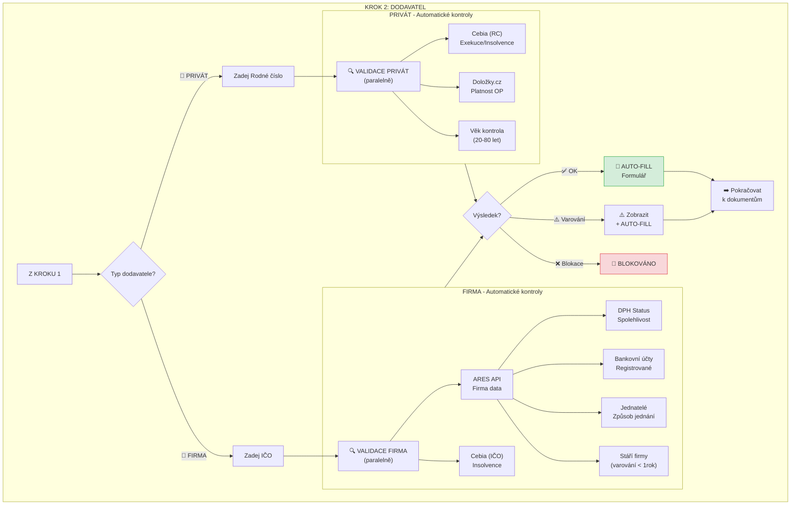
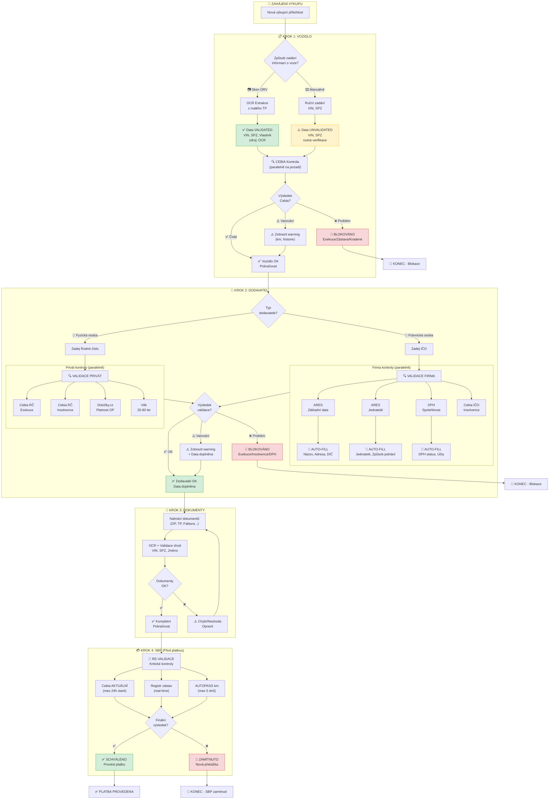

# SecureDeal AI - Redesign Výkupního Workflow

## Change Log

| Datum | Změna | Autor |
|-------|-------|-------|
| 2026-01-05 | Přesun Change Log na začátek, odstranění sekcí Cache strategie a Error handling | Jakub Strouhal |
| 2026-01-04 | Přidána sekce "Prověrky - Přehled" s rozdělením na placené/neplacené | Jakub Strouhal |
| 2026-01-04 | Aktualizována validační matice (6.1) - přidány sloupce Typ a Tým | Jakub Strouhal |
| 2026-01-04 | Reorganizována sekce 7.1 API integrace na placené/neplacené | Jakub Strouhal |
| 2026-01-04 | Smazány sekce 8.2, 9, 10 (mimo scope) | Jakub Strouhal |
| 2026-01-04 | Smazána sekce 8. UI/UX Doporučení (mimo scope) | Jakub Strouhal |
| 2025-12-31 | Iniciální verze dokumentu | Jakub Strouhal |

---

## Executive Summary

Tento dokument popisuje **redesign výkupního procesu**, kde validace zákazníka/dodavatele a vozidla probíhá **již v průběhu výkupu**, nikoli až ve fázi Safe Buying Payment (SBP).

### Klíčová změna filozofie

| Aspekt | Aktuálně (AS-IS) | Nově (TO-BE) |
|--------|-----------------|--------------|
| **Kdy validace** | Až v SBP fázi (před platbou) | Okamžitě při zadání dat |
| **Zdroj dat** | Manuální zadání na více místech | Jeden vstupní bod → automatické doplnění |
| **Zpětná vazba** | Opožděná (hodiny/dny) | **Okamžitá** (sekundy) |
| **UX** | Několik kroků, nejistota | Jeden flow, průběžná validace |

---

## Prověrky - Přehled

> **⚠️ ZODPOVĚDNOST:** Všechna API pro **placené prověrky** zajišťuje **tým DataMiningu**.
> Integrace **ARES a ostatních veřejných registrů** (neplacené) je součástí tohoto projektu (tým ARES/Buying Guide).

### Placené prověrky (tým DataMiningu)

| Prověrka | Služba | Endpoint | Kdy se provádí | Subjekt |
|----------|--------|----------|----------------|---------|
| **Cebia - Exekuce osoby** | CebiaExecutions | `cebiaexecutions-mp.api.aures.app` | Při zadání RČ/IČO | FO/PO |
| **Cebia - Insolvence osoby** | CebiaExecutions | `cebiaexecutions-mp.api.aures.app` | Při zadání RČ/IČO | FO/PO |
| **Cebia - Vozidlo (zástavy, kradené)** | CebiaService | `cebia-mp.api.aures.app` | Při zadání VIN | Vozidlo |
| **Cebia - AUTOTRACER (km historie)** | CebiaService | `cebia-mp.api.aures.app` | Při zadání VIN | Vozidlo |
| **eDálnice** | CheckService | `check-mp.api.aures.app` | Při zadání VIN | Vozidlo |
| **MDCR (technické kontroly)** | CheckService | `check-mp.api.aures.app` | Při zadání VIN | Vozidlo |

### Neplacené prověrky (veřejná API)

| Prověrka | Služba | Endpoint | Kdy se provádí | Subjekt |
|----------|--------|----------|----------------|---------|
| **Platnost OP** (Doložky.cz = MVČR) | MVČR Registr neplatných dokladů | `aplikace.mv.gov.cz/neplatne-doklady` | Po OCR/zadání čísla OP | FO |
| **ARES - Existence firmy** | ARES REST | `ares.gov.cz/ekonomicke-subjekty/{ico}` | Při zadání IČO | PO |
| **ARES - Jednatelé, způsob jednání** | ARES VR | `ares.gov.cz/ekonomicke-subjekty-vr/{ico}` | Při zadání IČO | PO |
| **DPH - Spolehlivost plátce** | ADIS SOAP | `adisrws.mfcr.cz` | Při zadání DIČ | PO |
| **DPH - Bankovní účty** | ADIS SOAP | `adisrws.mfcr.cz` | Při zadání DIČ | PO |
| **Věk kontrola (20-80 let)** | Výpočet z RČ | Lokální | Při zadání RČ | FO |
| **Stáří firmy (> 1 rok)** | Výpočet z ARES | Lokální | Po načtení ARES | PO |

### Kdy se placené prověrky spouští

```
┌─────────────────────────────────────────────────────────────────────────────┐
│  KROK 1 (VIN/SPZ)              │  KROK 2 (RČ/IČO)              │  SBP       │
├────────────────────────────────┼───────────────────────────────┼────────────┤
│  💰 Cebia vozidlo              │  💰 Cebia Exekuce/Insolvence  │  💰 Re-check│
│  💰 eDálnice                   │                               │            │
│  💰 MDCR                       │  🆓 ARES (veřejné)            │            │
│                                │  🆓 DPH (veřejné)             │            │
│                                │  🆓 MVČR OP (veřejné)         │            │
└────────────────────────────────┴───────────────────────────────┴────────────┘
  💰 = Placená prověrka (tým DataMiningu)
  🆓 = Neplacená prověrka (veřejné API)
```

---

## 1. Nový Výkupní Flow - Přehled

```
┌─────────────────────────────────────────────────────────────────────────────┐
│                     VÝKUPNÍ PŘÍLEŽITOST - NOVÝ FLOW                        │
├─────────────────────────────────────────────────────────────────────────────┤
│                                                                             │
│   ┌─────────────┐     ┌─────────────┐                                       │
│   │  KROK 1     │     │  KROK 2     │                                       │
│   │  VOZIDLO    │     │  DODAVATEL  │                                       │
│   │  (VIN/SPZ)  │────▶│  (IČO/RČ)   │────▶ VALIDACE ────▶ SBP ────▶ PLATBA │
│   └─────────────┘     └─────────────┘        ✓✓✓                            │
│         │                   │                                               │
│         ▼                   ▼                                               │
│   ┌─────────────┐     ┌─────────────┐                                       │
│   │ OCR nebo    │     │ Automatické │                                       │
│   │ Manuální    │     │ načtení     │                                       │
│   └─────────────┘     └─────────────┘                                       │
│                                                                             │
└─────────────────────────────────────────────────────────────────────────────┘
```

---

## 2. KROK 1: Informace o Vozidle

### 2.1 Vstupní možnosti



### 2.2 Datové pole - Vozidlo

| Pole | OCR Sken ORV | Manuální zadání | Validace |
|------|-------------|-----------------|----------|
| **VIN** | ✅ Auto (validated) | ⌨️ Nutné zadat | Cebia + BC shoda |
| **SPZ** | ✅ Auto (validated) | ⌨️ Nutné zadat | BC shoda |
| **Značka** | ✅ Auto | ⌨️ Nutné zadat | - |
| **Model** | ✅ Auto | ⌨️ Nutné zadat | - |
| **Rok výroby** | ✅ Auto | ⌨️ Nutné zadat | - |
| **Vlastník (jméno)** | ✅ Auto (validated) | - | Shoda s TP |

### 2.3 Validace spouštěné v KROKU 1

```yaml
Okamžitě po zadání VIN:
  - Cebia kontrola exekucí na vozidle
  - Cebia kontrola zástav
  - Shoda VIN s Business Center
  - Kontrola kradenéhod vozidla

Výsledky:
  🟢 ZELENÁ: Vozidlo čisté → pokračovat
  🟡 ORANŽOVÁ: Varování (např. manipulace km) → zobrazit upozornění
  🔴 ČERVENÁ: Blokace (exekuce, zástava) → STOP
```

---

## 3. KROK 2: Informace o Dodavateli (Zákazník)

### 3.1 Rozhodovací logika podle typu



### 3.2 FIRMA - Automatické doplnění z ARES (pouze na základě IČO)

```
┌──────────────────────────────────────────────────────────────────────────┐
│                    FIRMA: IČO → KOMPLETNÍ DATA                          │
├──────────────────────────────────────────────────────────────────────────┤
│                                                                          │
│   VSTUP: IČO "26835746"                                                  │
│                    │                                                     │
│                    ▼                                                     │
│   ┌────────────────────────────────────────┐                             │
│   │         ARES API VOLÁNÍ                │                             │
│   │   GET /ekonomicke-subjekty/{ico}       │                             │
│   │   GET /ekonomicke-subjekty-vr/{ico}    │                             │
│   │   + DPH SOAP kontrola                  │                             │
│   └────────────────────────────────────────┘                             │
│                    │                                                     │
│                    ▼                                                     │
│   ┌────────────────────────────────────────────────────────────────┐     │
│   │                    AUTO-FILL VÝSLEDEK                          │     │
│   ├────────────────────────────────────────────────────────────────┤     │
│   │  📝 Název firmy:     AUTOMOTOLAND CZ s.r.o.           ✅       │     │
│   │  📝 Adresa:          Ostravská 1941/38a, 748 01 Hlučín ✅       │     │
│   │  📝 DIČ:             CZ26835746                        ✅       │     │
│   │  📝 Právní forma:    s.r.o.                           ✅       │     │
│   │  📝 Datum založení:  31.05.2004 (20+ let)             ✅       │     │
│   │  📝 DPH plátce:      ANO - Spolehlivý                 ✅       │     │
│   │  📝 Bank. účet:      351361/5500                      ✅       │     │
│   │  📝 Jednatel:        ŠTĚPÁN VOZNICA (37 let)          ✅       │     │
│   │  📝 Způsob jednání:  Samostatně                       ✅       │     │
│   │  📝 Insolvence:      NE                               ✅       │     │
│   └────────────────────────────────────────────────────────────────┘     │
│                                                                          │
│   VALIDAČNÍ VÝSLEDKY:                                                    │
│   ┌──────────────────────────────────────────────────────────────┐       │
│   │  ✅ Firma existuje v ARES                                    │       │
│   │  ✅ DPH - spolehlivý plátce                                  │       │
│   │  ✅ Bankovní účet registrován                                │       │
│   │  ✅ Firma starší 1 roku                                      │       │
│   │  ✅ Jednatel ve funkci > 30 dnů                              │       │
│   │  ✅ Žádná insolvence                                         │       │
│   └──────────────────────────────────────────────────────────────┘       │
│                                                                          │
└──────────────────────────────────────────────────────────────────────────┘
```

### 3.3 PRIVÁT - Automatická validace (na základě Rodného čísla)

```
┌──────────────────────────────────────────────────────────────────────────┐
│                    PRIVÁT: RČ → VALIDACE                                │
├──────────────────────────────────────────────────────────────────────────┤
│                                                                          │
│   VSTUP: RČ "870409/1234"                                                │
│                    │                                                     │
│                    ▼                                                     │
│   ┌────────────────────────────────────────┐                             │
│   │      PARALELNÍ KONTROLY               │                             │
│   │   ┌─────────┐  ┌─────────┐  ┌───────┐ │                             │
│   │   │ Cebia   │  │Doložky  │  │ Věk   │ │                             │
│   │   │ API     │  │.cz API  │  │výpočet│ │                             │
│   │   └─────────┘  └─────────┘  └───────┘ │                             │
│   └────────────────────────────────────────┘                             │
│                    │                                                     │
│                    ▼                                                     │
│   ┌────────────────────────────────────────────────────────────────┐     │
│   │                    VALIDAČNÍ VÝSLEDEK                          │     │
│   ├────────────────────────────────────────────────────────────────┤     │
│   │  ✅ Exekuce:        Žádné aktivní                              │     │
│   │  ✅ Insolvence:     Žádná                                      │     │
│   │  ✅ Platnost OP:    Platný do 2028                             │     │
│   │  ✅ Věk:            37 let (v rozmezí 20-80)                   │     │
│   └────────────────────────────────────────────────────────────────┘     │
│                                                                          │
│   POZNÁMKA: Osobní údaje (jméno, adresa) se NEDOPLŇUJÍ automaticky      │
│             → Tyto údaje dodá uživatel nebo OCR z OP                     │
│                                                                          │
└──────────────────────────────────────────────────────────────────────────┘
```

### 3.4 Validační pravidla podle typu dodavatele

| Kontrola | PRIVÁT | FIRMA | Kdy běží | Blokující? |
|----------|--------|-------|----------|------------|
| **Cebia - Exekuce** | ✅ (RČ) | ✅ (IČO) | Okamžitě | ✅ ANO |
| **Cebia - Insolvence** | ✅ (RČ) | ✅ (IČO) | Okamžitě | ✅ ANO |
| **ARES - Existence firmy** | - | ✅ | Okamžitě | ✅ ANO |
| **ARES - DPH spolehlivost** | - | ✅ | Okamžitě | ✅ ANO |
| **ARES - Bankovní účet** | - | ✅ | Okamžitě | ✅ ANO |
| **ARES - Jednatelé** | - | ✅ | Okamžitě | ⚠️ Částečně |
| **ARES - Stáří firmy** | - | ✅ | Okamžitě | ⚠️ Varování |
| **Doložky.cz - OP** | ✅ | - | Okamžitě | ✅ ANO |
| **Věk 20-80 let** | ✅ | - | Okamžitě | ⚠️ Varování |

---

## 4. Kompletní Nový Flow - Mermaid Diagram



---

## 5. Srovnání: Starý vs. Nový Proces

### 5.1 Timing validací

```
STARÝ PROCES (AS-IS):
═══════════════════════════════════════════════════════════════════════
│ Výkup          │ Zadání dat    │ Čekání      │ SBP           │ Platba │
│ (vozidlo)      │ (manuálně)    │ (hodiny)    │ (VALIDACE)    │        │
═══════════════════════════════════════════════════════════════════════
                                               ▲
                                               │ Všechny validace až zde
                                               │ (pozdě na opravu)


NOVÝ PROCES (TO-BE):
═══════════════════════════════════════════════════════════════════════
│ Výkup              │ Dodavatel            │ Dokumenty │ SBP    │Platba│
│ (vozidlo+validace) │ (IČO/RČ+validace)    │ (+OCR)    │(re-val)│      │
═══════════════════════════════════════════════════════════════════════
  ▲                    ▲                       ▲          ▲
  │                    │                       │          │
  │ Cebia vozidlo      │ ARES + Cebia osoba   │ Shoda    │ Kritické
  │ (okamžitě)         │ (okamžitě)           │ dat      │ (aktuální)
```

### 5.2 Přehled změn

| Aspekt | Starý proces | Nový proces |
|--------|-------------|-------------|
| **Zadání vozidla** | Manuálně, vícekrát | OCR sken NEBO 1× manuálně |
| **Validace vozidla** | Až v SBP | **Okamžitě při zadání** |
| **Zadání dodavatele** | Všechna pole manuálně | Pouze IČO/RČ → auto-fill |
| **Validace dodavatele** | Až v SBP | **Okamžitě při zadání** |
| **ARES načtení** | Manuální kopírování | **Automatické z API** |
| **DPH kontrola** | Manuální | **Automatická** |
| **Zpětná vazba** | Po hodinách/dnech | **Sekundy** |
| **Blokace** | Až před platbou | **Okamžitě (early warning)** |

---

## 6. Validační Matice - Kdy co běží

### 6.1 Okamžité validace (KROK 1 + 2)

| Kontrola | Trigger | Čas | Blokující? | Typ | Tým |
|----------|---------|-----|------------|-----|-----|
| Cebia - vozidlo (VIN) | Po zadání VIN | <1s | ✅ | 💰 Placená | DataMining |
| Cebia - osoba (RČ) | Po zadání RČ | <1s | ✅ | 💰 Placená | DataMining |
| Cebia - firma (IČO) | Po zadání IČO | <1s | ✅ | 💰 Placená | DataMining |
| ARES - základní data | Po zadání IČO | <2s | ✅ | 🆓 Neplacená | DataMining |
| ARES - jednatelé | Po zadání IČO | <2s | ⚠️ | 🆓 Neplacená | DataMining |
| ARES - DPH | Po zadání IČO | <3s | ✅ | 🆓 Neplacená | DataMining |
| Doložky.cz - OP (= MVČR) | Po OCR OP | <2s | ✅ | 🆓 Neplacená | DataMining |
| Věk kontrola | Po OCR/zadání RČ | <1s | ⚠️ | 🆓 Neplacená | ARES/BG |
| Stáří firmy | Po ARES | <1s | ⚠️ | 🆓 Neplacená | ARES/BG |

### 6.2 Dokumentové validace (KROK 3)

| Kontrola | Trigger | Čas | Blokující? |
|----------|---------|-----|------------|
| Kompletnost dokumentů | Po upload | <1s | ✅ |
| VIN shoda (TP vs BC) | Po OCR TP | <1s | ✅ |
| SPZ shoda (ORV vs BC) | Po OCR ORV | <1s | ✅ |
| Jméno shoda (TP vs OP) | Po OCR obou | <1s | ✅ |
| Plná moc validita | Po upload PM | <1s | ✅ |

### 6.3 SBP validace (KROK 4 - těsně před platbou)

| Kontrola | Důvod | Čas | Blokující? |
|----------|-------|-----|------------|
| Cebia RE-CHECK | Data stárnou | <1s | ✅ |
| Registr zástav | Real-time nutné | 1-2min | ✅ |
| AUTOPASS km | Max 5 dnů stará | <2s | ⚠️ |
| Datum přeregistrace | 10 dnů kontrola | <1s | ⚠️ |

---

## 7. Technické Požadavky

### 7.1 API integrace podle typu

#### 💰 Placené API (tým DataMiningu - již existují)

| Služba | Endpoint | Dokumentace | Status |
|--------|----------|-------------|--------|
| **CebiaExecutions** | `cebiaexecutions-mp.api.aures.app` | [CEBIA_EXECUTIONS_API_HOWTO.md](../Agents/CEBIA_EXECUTIONS_API_HOWTO.md) | ✅ Existuje |
| **CebiaService** | `cebia-mp.api.aures.app` | [CEBIA_SERVICES_API_REFERENCE.md](../Agents/CEBIA_SERVICES_API_REFERENCE.md) | ✅ Existuje |
| **CheckService** | `check-mp.api.aures.app` | [CEBIA_SERVICES_API_REFERENCE.md](../Agents/CEBIA_SERVICES_API_REFERENCE.md) | ✅ Existuje |

> **Poznámka:** Všechna placená API jsou spravována týmem DataMiningu a již existují.
> Pro integraci kontaktujte tým DataMiningu.

#### 🆓 Neplacené API (veřejné registry - nutno integrovat)

| Služba | Endpoint | Dokumentace | Status |
|--------|----------|-------------|--------|
| **ARES REST** | `ares.gov.cz/ekonomicke-subjekty-v-be/rest` | [EXTERNAL_REGISTRIES_INTEGRATION_GUIDE.md](../Agents/EXTERNAL_REGISTRIES_INTEGRATION_GUIDE.md) | 🔄 K integraci |
| **ARES VR** | `ares.gov.cz/ekonomicke-subjekty-v-be/rest` | [EXTERNAL_REGISTRIES_INTEGRATION_GUIDE.md](../Agents/EXTERNAL_REGISTRIES_INTEGRATION_GUIDE.md) | 🔄 K integraci |
| **DPH SOAP (ADIS)** | `adisrws.mfcr.cz` | [EXTERNAL_REGISTRIES_INTEGRATION_GUIDE.md](../Agents/EXTERNAL_REGISTRIES_INTEGRATION_GUIDE.md) | 🔄 K integraci |
| **MVČR (Doložky.cz)** | `aplikace.mv.gov.cz/neplatne-doklady` | [EXTERNAL_REGISTRIES_INTEGRATION_GUIDE.md](../Agents/EXTERNAL_REGISTRIES_INTEGRATION_GUIDE.md) | 🔄 K integraci |
| **OCR služba** | DocumentCenter5G | Interní | ✅ Existuje |

#### Doporučené rozšíření

```yaml
Budoucí integrace:
  - AUTOPASS API (km historie) - 💰 Placená
  - Notářský rejstřík (zástavy) - 🆓 Neplacená
```

---

**Dokument vytvořen:** 2025-12-31
**Aktualizováno:** 2026-01-05
**Autor:** Jakub Strouhal
**Status:** NÁVRH K REVIEW
