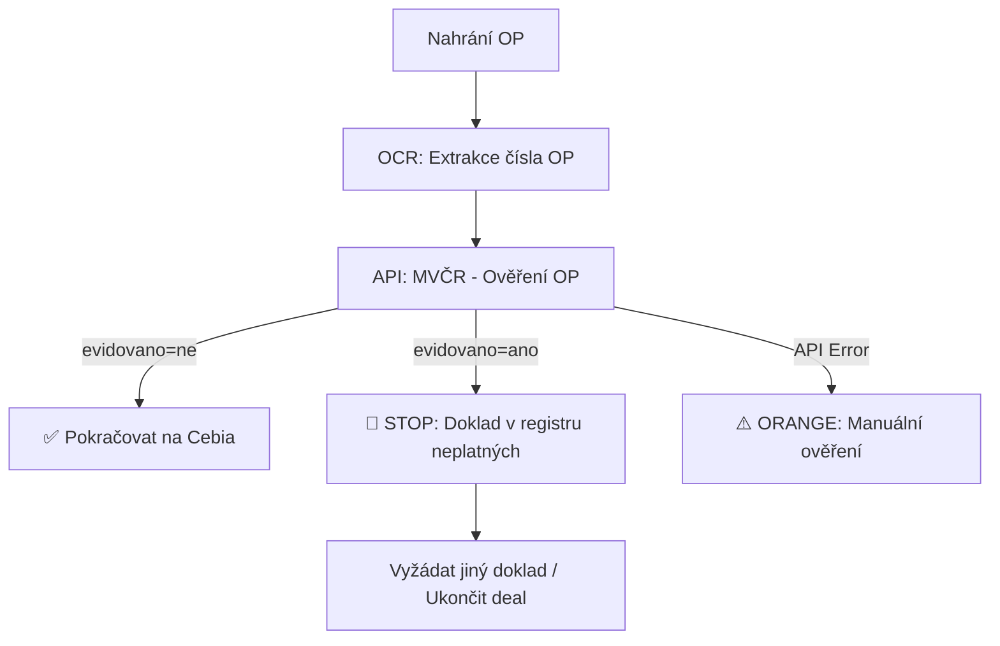

# External Registries Integration Guide - SecureDeal AI

**Verze:** 2.1
**Stav:** Technická specifikace
**Vytvořeno:** 2025-12-29
**Aktualizováno:** 2025-12-31
**Účel:** API dokumentace a datové mapování pro validaci subjektů a dokladů

---

## 1. Executive Summary

Tento dokument popisuje integrace s externími registry pro validaci subjektů a dokladů v SecureDeal AI:

- **ARES** - Administrativní registr ekonomických subjektů (validace firem)
- **Registr DPH (ADIS)** - Ověření spolehlivosti plátce DPH a bankovních účtů
- **MVČR Registr neplatných dokladů** - Ověření platnosti dokladů totožnosti (OP, pasy, zbrojní průkazy)

### Přehled služeb

| Služba | Účel | Typ API | Autentizace |
|--------|------|---------|-------------|
| **ARES REST** | Základní data firem | REST | Veřejné |
| **ARES VR** | Jednatelé, způsob jednání | REST | Veřejné |
| **Registr DPH** | Spolehlivost plátce, účty | SOAP | Veřejné |
| **MVČR Neplatné doklady** | Platnost OP, pasů | HTTP GET (XML) | Veřejné |

### Pokrytí validačních kontrol

| Kontrola | Služba | Typ subjektu |
|----------|--------|--------------|
| #1 ARES - existence firmy | ARES | PO (firma, DLR, autobazar) |
| #2 Účet firmy v ARES | Registr DPH | PO |
| #4 Platnost OP/pasu | MVČR Registr neplatných dokladů | FO (privát) |
| #5 Stáří firmy > 1 rok | ARES | PO |
| #6 Věk jednatele 20-80 | ARES VR | PO |
| #8 Platnost plné moci | Manuální ověření (notářská doložka) | Zprostředkovaný prodej |

---

## 2. Dostupná data z externích registrů

### 2.1 Registry právnických osob (ARES, DPH)

| Informace | ARES Základní | ARES VR | Registr DPH | Poznámka |
|-----------|:-------------:|:-------:|:-----------:|----------|
| Název firmy | ✅ | ✅ | ❌ | |
| IČO | ✅ | ✅ | ❌ | |
| DIČ | ✅ | ❌ | ✅ | |
| Sídlo | ✅ | ✅ | ❌ | |
| Datum vzniku | ✅ | ✅ | ❌ | Pro výpočet stáří firmy |
| Právní forma | ✅ | ✅ | ❌ | |
| CZ-NACE činnosti | ✅ | ❌ | ❌ | |
| Registrace (VR, DPH, RŽP) | ✅ | ❌ | ❌ | |
| **Jednatelé** | ❌ | ✅ | ❌ | Jméno, datum narození, funkce |
| **Společníci** | ❌ | ✅ | ❌ | Jméno, podíl |
| **Způsob jednání** | ❌ | ✅ | ❌ | Samostatně/společně |
| **Základní kapitál** | ❌ | ✅ | ❌ | Hodnota, splaceno |
| **Insolvence** | ❌ | ✅ | ❌ | Status |
| **Spolehlivost plátce DPH** | ❌ | ❌ | ✅ | Nespolehlivý plátce ANO/NE |
| **Bankovní účty** | ❌ | ❌ | ✅ | Zveřejněné účty pro DPH |

### 2.2 Registry dokladů (MVČR)

| Informace | MVČR API | Poznámka |
|-----------|:--------:|----------|
| **Evidence OP v neplatných** | ✅ | Ověření zda OP není ztracený/odcizený |
| **Evidence pasu v neplatných** | ✅ | Ověření zda pas není ztracený/odcizený |
| **Evidence zbrojního průkazu** | ✅ | Ověření zda ZP není neplatný |
| Číslo dokladu | ✅ | Vstupní parametr |
| Datum aktualizace DB | ✅ | Kdy byla databáze naposledy aktualizována |

**Poznámka:** MVČR API ověřuje pouze, zda doklad **není** v registru neplatných. Nepotvrzuje existenci ani pravost dokladu.

### 2.3 Přehled endpointů

| Registr | Endpoint | Autentizace |
|---------|----------|-------------|
| ARES Základní | `GET /ekonomicke-subjekty/{ico}` | Veřejné |
| ARES VR | `GET /ekonomicke-subjekty-vr/{ico}` | Veřejné |
| DPH Spolehlivost | SOAP `StatusNespolehlivyPlatceRequest` | Veřejné |
| DPH Účty | SOAP `SeznamBankovnichUctuRequest` | Veřejné |
| MVČR Neplatné doklady | `GET /neplatne-doklady/doklady.aspx?dotaz={cislo}&doklad={typ}` | Veřejné |

---

## 3. ARES REST API

### Base URL

```
https://ares.gov.cz/ekonomicke-subjekty-v-be/rest
```

### 3.1 Základní vyhledání firmy

```http
GET /ekonomicke-subjekty/{ico}
```

**Path Parameters:**
| Parametr | Typ | Formát | Povinný | Popis |
|----------|-----|--------|---------|-------|
| `ico` | string | `^\d{8}$` | Ano | 8místné IČO |

**Příklad:**
```bash
curl -X GET "https://ares.gov.cz/ekonomicke-subjekty-v-be/rest/ekonomicke-subjekty/26835746" \
  -H "Accept: application/json"
```

**Mapování na validační pole:**

| Response pole | Validace | Použití |
|---------------|----------|---------|
| `ico` | #1 ARES | Potvrzení existence firmy |
| `obchodniJmeno` | #1 ARES | Kontrola názvu |
| `datumVzniku` | #5 Datum založení | Výpočet stáří firmy |
| `dic` | #1 ARES | Propojení s DPH registrem |
| `seznamRegistraci[].stavZdrojeDph` | #1 ARES | Status plátce DPH |

---

### 3.2 Veřejný rejstřík (jednatelé, statutární orgány)

```http
GET /ekonomicke-subjekty-vr/{ico}
```

**Kritické pole `zpusobJednani`:**

| Hodnota | Interpretace | Validace |
|---------|--------------|----------|
| `"samostatně"` | Každý jednatel může jednat sám | SC-FIRMA-JEDNATEL-SAM |
| `"společně"` | Musí jednat všichni společně | SC-FIRMA-JEDNATEL-SPOLU |
| `"dva členové společně"` | Minimálně 2 jednatelé | SC-FIRMA-JEDNATEL-SPOLU |

**Mapování na validační pole:**

| Response pole | Validace | Použití |
|---------------|----------|---------|
| `statutarniOrgany[].clenove[]` | #6 Věk jednatele | Seznam jednatelů |
| `statutarniOrgany[].clenove[].datumNarozeni` | #6 Věk jednatele | Výpočet věku |
| `statutarniOrgany[].clenove[].clenstvi.datumVzniku` | #6 Věk jednatele | Délka ve funkci |
| `statutarniOrgany[].zpusobJednani` | Scénář | Určení typu jednání |
| `insolvence` | #9 Cebia (doplněk) | Status insolvence |

---

### 3.3 Hromadné vyhledání

```http
POST /ekonomicke-subjekty/vyhledat
```

**Request Body:**
```json
{
  "start": 0,
  "pocet": 100,
  "ico": ["26835746", "12345678"],
  "obchodniJmeno": "AURES",
  "pravniForma": ["112", "121"],
  "sidlo": {
    "kodObce": "554782"
  }
}
```

---

### 3.4 Další registry

| Endpoint | Registr | Klíčová data |
|----------|---------|--------------|
| `/ekonomicke-subjekty-res/{ico}` | RES | Statistické údaje, převažující NACE |
| `/ekonomicke-subjekty-rzp/{ico}` | RŽP | Živnosti, provozovny, OSVČ |
| `/ekonomicke-subjekty-rcns/{ico}` | RCNS | Církevní organizace |
| `/ekonomicke-subjekty-rpsh/{ico}` | RPSH | Politické strany |
| `/ekonomicke-subjekty-szr/{ico}` | SZR | Zemědělští podnikatelé |
| `/ekonomicke-subjekty-nrpzs/{ico}` | NRPZS | Zdravotnická zařízení |

---

## 4. Registr DPH (ADIS)

### 4.1 SOAP API

**Endpoint:** `https://adisrws.mfcr.cz/dpr/axis2/services/rozhraniCRPDPH.rozhraniCRPDPHSOAP`

**WSDL:** `https://adisrws.mfcr.cz/dpr/axis2/services/rozhraniCRPDPH.rozhraniCRPDPHSOAP?wsdl`

**Dostupné operace:**
| Operace | Popis |
|---------|-------|
| `getStatusNespolehlivyPlatce` | Status + bankovní účty |
| `getStatusNespolehlivyPlatceRozsireny` | Status + účty + název + adresa |
| `getSeznamNespolehlivyPlatce` | Celý seznam nespolehlivých plátců |

### 4.2 Ověření spolehlivosti plátce

**cURL příkaz:**
```bash
curl -X POST "https://adisrws.mfcr.cz/dpr/axis2/services/rozhraniCRPDPH.rozhraniCRPDPHSOAP" \
  -H "Content-Type: text/xml; charset=utf-8" \
  -H "SOAPAction: \"getStatusNespolehlivyPlatceRozsireny\"" \
  -d '<?xml version="1.0" encoding="UTF-8"?>
<soap:Envelope xmlns:soap="http://schemas.xmlsoap.org/soap/envelope/"
               xmlns:roz="http://adis.mfcr.cz/rozhraniCRPDPH/">
  <soap:Body>
    <roz:StatusNespolehlivyPlatceRequest>
      <roz:dic>CZ26835746</roz:dic>
    </roz:StatusNespolehlivyPlatceRequest>
  </soap:Body>
</soap:Envelope>'
```

### 4.3 Interpretace výsledků

| Pole | Hodnota | Validační výsledek |
|------|---------|-------------------|
| `nespolehlivyPlatce` | `NE` | ✅ ZELENÁ |
| `nespolehlivyPlatce` | `ANO` | ❌ ČERVENÁ (blokováno) |
| `statusPlatce` | `AKTIVNI` | ✅ ZELENÁ |
| `statusPlatce` | `NEAKTIVNI` | ❌ ČERVENÁ |
| Účet shoda | Match | ✅ ZELENÁ |
| Účet neshoda | No match | ❌ ČERVENÁ |
| Účet není v seznamu | Not found | ⚠️ ORANŽOVÁ |

### 4.4 Mapování kódů bank

| Kód | Banka |
|-----|-------|
| 0100 | Komerční banka |
| 0300 | ČSOB |
| 0800 | Česká spořitelna |
| 2010 | Fio banka |
| 5500 | Raiffeisenbank |
| 6100 | Equa bank |

---

## 5. Reálné API Response příklady

### 5.1 AUTOMOTOLAND CZ s.r.o. (IČO 26835746)

#### Základní informace - Response

```json
{
  "ico": "26835746",
  "obchodniJmeno": "AUTOMOTOLAND CZ s.r.o.",
  "sidlo": {
    "kodStatu": "CZ",
    "nazevStatu": "Česká republika",
    "kodKraje": "80",
    "nazevKraje": "Moravskoslezský kraj",
    "kodOkresu": "8106",
    "nazevOkresu": "Opava",
    "kodObce": "508942",
    "nazevObce": "Hlučín",
    "nazevUlice": "Ostravská",
    "cisloDomovni": 1941,
    "cisloOrientacni": "38a",
    "psc": "74801",
    "textovaAdresa": "Ostravská 1941/38a, 748 01 Hlučín"
  },
  "pravniForma": {
    "kod": "112",
    "nazev": "Společnost s ručením omezeným"
  },
  "dic": "CZ26835746",
  "datumVzniku": "2004-05-31",
  "datumZaniku": null,
  "datumAktualizace": "2025-12-09T00:00:00Z",
  "czNace": [
    { "kod": "451", "nazev": "Stavba budov" },
    { "kod": "45200", "nazev": "Přípravné práce" },
    { "kod": "49410", "nazev": "Ostatní pozemní doprava" }
  ],
  "seznamRegistraci": [
    { "zdrojRegistr": "ROS", "stavZdrojeVr": "AKTIVNI" },
    { "zdrojRegistr": "VR", "stavZdrojeVr": "AKTIVNI", "datumZapisu": "2004-05-31" },
    { "zdrojRegistr": "DPH", "stavZdrojeDph": "PLATCE" }
  ]
}
```

**Validační výstupy:**

| Pole | Hodnota | Validace |
|------|---------|----------|
| `datumVzniku` | 2004-05-31 | ✅ Check #5 (stáří > 1 rok) |
| `dic` | CZ26835746 | Propojení s Registrem DPH |
| `seznamRegistraci[DPH].stavZdrojeDph` | PLATCE | ✅ Je plátce DPH |
| `pravniForma.kod` | 112 | s.r.o. → kontrola jednatelů |

---

#### Veřejný rejstřík - Response

```json
{
  "ico": "26835746",
  "zaznamy": [
    {
      "primaryZaznam": true,
      "stavSubjektu": "AKTIVNI",
      "obchodniJmeno": "AUTOMOTOLAND CZ s.r.o.",
      "pravniForma": {
        "kod": "112",
        "nazev": "Společnost s ručením omezeným"
      },
      "statutarniOrgany": [
        {
          "nazev": "Jednatel",
          "zpusobJednani": "Jednatelé zastupují společnost v plném rozsahu samostatně.",
          "pocetClenu": 3,
          "clenove": [
            {
              "jmeno": "ŠTĚPÁN",
              "prijmeni": "VOZNICA",
              "datumNarozeni": "1987-04-09",
              "funkce": "jednatel",
              "adresa": { "textovaAdresa": "Lípová 1506/7, Ludgeřovice" },
              "clenstvi": { "datumVzniku": "2016-07-16", "datumZaniku": null }
            },
            {
              "jmeno": "MARIE",
              "prijmeni": "VOZNICOVÁ",
              "datumNarozeni": "1959-08-23",
              "funkce": "jednatel",
              "clenstvi": { "datumVzniku": "2004-05-31", "datumZaniku": null }
            },
            {
              "jmeno": "JOSEF",
              "prijmeni": "VOZNICA",
              "datumNarozeni": "1956-09-05",
              "funkce": "jednatel",
              "clenstvi": { "datumVzniku": "2025-10-29", "datumZaniku": null }
            }
          ]
        }
      ],
      "spolecnici": [
        { "jmeno": "JOSEF", "prijmeni": "VOZNICA", "podil": { "procento": 25 } },
        { "jmeno": "MARIE", "prijmeni": "VOZNICOVÁ", "podil": { "procento": 25 } },
        { "jmeno": "ŠTĚPÁN", "prijmeni": "VOZNICA", "podil": { "procento": 25 } },
        { "jmeno": "JOLANA", "prijmeni": "ŠIMEČKOVÁ", "podil": { "procento": 25 } }
      ],
      "zakladniKapital": {
        "hodnota": 8200000,
        "mena": "CZK",
        "splaceno": 8200000
      },
      "insolvence": null
    }
  ]
}
```

**Analýza jednatelů (Check #6 - věk 20-80 let):**

| Jednatel | Datum narození | Věk | Ve funkci od | Status |
|----------|----------------|-----|--------------|--------|
| ŠTĚPÁN VOZNICA | 9.4.1987 | 38 let | 16.7.2016 | ✅ OK |
| MARIE VOZNICOVÁ | 23.8.1959 | 66 let | 31.5.2004 | ✅ OK |
| JOSEF VOZNICA | 5.9.1956 | 69 let | 29.10.2025 | ⚠️ Nový jednatel |

**Způsob jednání:** `"Jednatelé zastupují společnost v plném rozsahu samostatně."` → **SC-FIRMA-JEDNATEL-SAM**

---

#### DPH Registr - SOAP Response

```xml
<?xml version="1.0" encoding="utf-8"?>
<soapenv:Envelope xmlns:soapenv="http://schemas.xmlsoap.org/soap/envelope/">
  <soapenv:Body>
    <StatusNespolehlivyPlatceRozsirenyResponse xmlns="http://adis.mfcr.cz/rozhraniCRPDPH/">
      <status odpovedGenerovana="2025-12-31" statusCode="0" statusText="OK"/>
      <statusPlatceDPH dic="CZ26835746" nespolehlivyPlatce="NE" cisloFu="463">
        <zverejneneUcty>
          <ucet datumZverejneni="2020-04-04">
            <standardniUcet cislo="351361" kodBanky="5500"/>
          </ucet>
        </zverejneneUcty>
        <nazevSubjektu>AUTOMOTOLAND CZ</nazevSubjektu>
        <adresa>
          <uliceCislo>Ostravská 1941/38a</uliceCislo>
          <mesto>HLUČÍN</mesto>
          <psc>74801</psc>
        </adresa>
      </statusPlatceDPH>
    </StatusNespolehlivyPlatceRozsirenyResponse>
  </soapenv:Body>
</soapenv:Envelope>
```

**Výsledek:**
| Atribut | Hodnota | Význam |
|---------|---------|--------|
| `nespolehlivyPlatce` | `NE` | ✅ Spolehlivý plátce |
| `cisloFu` | `463` | FÚ Moravskoslezský kraj |
| Bankovní účet | `351361/5500` | Raiffeisenbank |

---

## 6. Rate Limiting a Caching

### ARES Rate Limits

| Časové okno | Limit | Doporučení |
|-------------|-------|------------|
| 08:00-18:00 | 1000 požadavků | Max ~1.5 req/min |
| 18:00-08:00 | 5000 požadavků | Max ~6 req/min |

### Doporučené TTL pro cache

| Data | TTL | Důvod |
|------|-----|-------|
| Základní data firmy | 24h | Stabilní |
| Data z VR (jednatelé) | 24h | Změny zřídka |
| DPH status | 4h | Může se změnit |
| Bankovní účty | 12h | Relativně stabilní |

### Cache Key Format

```
ares:ico:{ico}           → EkonomickySubjekt
ares:vr:{ico}            → EkonomickySubjektVr
dph:status:{dic}         → VatPayerStatus
dph:accounts:{dic}       → List<BankAccount>
```

---

## 7. Error Handling

### Fallback Strategy

```yaml
OnError:
  AresNotFoundException:
    Action: Return null
    Status: RED (firma neexistuje)

  AresRateLimitException:
    Action: Retry with exponential backoff (3x)
    FinalStatus: ORANGE (nelze ověřit)
    RequiresRetry: true

  AresTimeoutException:
    Action: Retry once
    FinalStatus: ORANGE (služba nedostupná)
    RequiresManualCheck: true

  AresServiceException:
    Action: Log, return ORANGE
    RequiresManualCheck: true
```

---

## 8. Test Data

### Test IČO Numbers

| IČO | Popis | Očekávaný výsledek |
|-----|-------|-------------------|
| `26835746` | AUTOMOTOLAND CZ s.r.o. | ✅ Aktivní, plátce DPH, 3 jednatelé |
| `00000001` | Neexistující | ❌ Not found |
| `27082440` | Velká firma | ✅ Mnoho jednatelů |
| `45534276` | AURES Holdings, a.s. | ✅ Aktivní, plátce DPH |

---

## 9. MVČR Registr neplatných dokladů

### 9.1 Přehled služby

**Registr neplatných dokladů** je veřejná služba Ministerstva vnitra ČR pro ověření, zda doklad totožnosti není evidován jako neplatný (ztracený, odcizený, zrušený).

| Aspekt | Detail |
|--------|--------|
| **Provozovatel** | Ministerstvo vnitra ČR |
| **Typ API** | HTTP GET (XML odpověď) |
| **Autentizace** | Žádná (veřejné API) |
| **Rate Limits** | Není specifikováno (doporučeno max 1 req/s) |
| **Dostupnost** | 24/7 |
| **Aktualizace dat** | Denně |

### 9.2 API Endpoint

#### Base URL

```
https://aplikace.mv.gov.cz/neplatne-doklady
```

> **Poznámka:** Stará URL `https://aplikace.mvcr.cz/neplatne-doklady` vrací 301 redirect na novou doménu.

#### 9.2.1 Ověření dokladu (HTTP GET)

```http
GET /doklady.aspx?dotaz={cisloDokladu}&doklad={typDokladu}
```

**Query Parameters:**

| Parametr | Typ | Povinný | Popis |
|----------|-----|---------|-------|
| `dotaz` | string | Ano | Číslo dokladu (bez mezer) |
| `doklad` | integer | Ano | Typ dokladu (viz tabulka níže) |

**Typy dokladů:**

| Kód | Typ dokladu |
|-----|-------------|
| `0` | Občanský průkaz (OP) |
| `4` | Cestovní pas (fialový) |
| `6` | Zbrojní průkaz |

**Příklady volání:**

```bash
# Ověření občanského průkazu
curl "https://aplikace.mv.gov.cz/neplatne-doklady/doklady.aspx?dotaz=215674125&doklad=0"

# Ověření cestovního pasu
curl "https://aplikace.mv.gov.cz/neplatne-doklady/doklady.aspx?dotaz=99123456&doklad=4"

# Ověření zbrojního průkazu
curl "https://aplikace.mv.gov.cz/neplatne-doklady/doklady.aspx?dotaz=ABC123&doklad=6"
```

#### 9.2.2 Struktura XML odpovědi

**Doklad NENÍ v registru neplatných (čistý):**

```xml
<?xml version="1.0" encoding="utf-8"?>
<doklady_neplatne posl_zmena="12.8.2010" pristi_zmeny="">
  <dotaz typ="OP" cislo="215674125" serie="-" />
  <odpoved aktualizovano="31.12.2025" evidovano="ne" />
</doklady_neplatne>
```

**Doklad JE v registru neplatných (ztracený/odcizený):**

```xml
<?xml version="1.0" encoding="utf-8"?>
<doklady_neplatne posl_zmena="12.8.2010" pristi_zmeny="">
  <dotaz typ="OP" cislo="123456789" serie="-" />
  <odpoved aktualizovano="31.12.2025" evidovano="ano" />
</doklady_neplatne>
```

**Mapování XML polí:**

| XML Element/Atribut | Popis |
|---------------------|-------|
| `doklady_neplatne/@posl_zmena` | Datum poslední změny struktury |
| `dotaz/@typ` | Typ dokladu (OP, PAS, ZP) |
| `dotaz/@cislo` | Dotazované číslo dokladu |
| `dotaz/@serie` | Série dokladu (pro starší OP) |
| `odpoved/@aktualizovano` | Datum aktualizace databáze |
| `odpoved/@evidovano` | **Klíčové pole:** `ano` / `ne` |

### 9.3 Interpretace výsledků

| `evidovano` | Význam | Validační výsledek | Akce |
|-------------|--------|-------------------|------|
| `ne` | Doklad NENÍ v registru neplatných | ✅ ZELENÁ | Pokračovat |
| `ano` | Doklad JE v registru neplatných | ❌ ČERVENÁ | **STOP** - doklad je ztracený/odcizený |

### 9.4 Validační pravidla (Check #4)

| Scénář | Výsledek | Akce |
|--------|----------|------|
| `evidovano="ne"` | ✅ ZELENÁ | Pokračovat v procesu |
| `evidovano="ano"` | ❌ ČERVENÁ | **OKAMŽITÝ STOP** - riziko podvodu |
| API nedostupné | ⚠️ ORANŽOVÁ | Manuální ověření |
| Timeout | ⚠️ ORANŽOVÁ | Retry 1x, pak manuální |

### 9.5 Integrace do SecureDeal workflow

#### Kdy se kontrola provádí

| Typ subjektu | Kontrola OP/Pasu | Poznámka |
|--------------|:----------------:|----------|
| **PRIVÁT** | ✅ Povinné | Vždy ověřit OP prodávajícího |
| **ZPROSTŘEDKOVANÝ** | ✅ Povinné | OP zmocnitele i zmocněnce |
| **DĚDICTVÍ** | ✅ Povinné | OP dědice |
| **FIRMA** | ✅ Povinné | OP jednatele |
| **DLR/AUTOBAZAR** | ❌ Ne | Ověřeno při registraci partnera |

#### Procesní flow pro PRIVÁT



### 9.6 Alternativa: Hromadné stažení dat (Open Data)

Pro vysoký objem ověření je možné stáhnout celou databázi a ověřovat lokálně.

**URL pro stažení:** `https://aplikace.mv.gov.cz/neplatne-doklady/`

#### Kompletní seznamy (všechny záznamy)

| Soubor | Obsah | Popis |
|--------|-------|-------|
| `op_vse.zip` | Neplatné OP bez série | Nové typy občanských průkazů |
| `ops_vse.zip` | Neplatné OP se sérií | Starší typy občanských průkazů |
| `cd_vse.zip` | Neplatné cestovní pasy | Centrálně vydávané (vínové) |
| `zp_vse.zip` | Neplatné zbrojní průkazy | Včetně muničních průkazů a licencí |

#### Denní změny (inkrementální aktualizace)

| Soubor | Obsah |
|--------|-------|
| `op_rozdil.zip` | Denní změny - OP bez série |
| `ops_rozdil.zip` | Denní změny - OP se sérií |
| `cd_rozdil.zip` | Denní změny - cestovní pasy |
| `zp_rozdil.zip` | Denní změny - zbrojní průkazy |

**Formát souborů:** TXT (seznam čísel dokladů, jeden na řádek)

**Aktualizace:** Denně v ranních hodinách. Nové záznamy se objeví do ~24 hodin od nahlášení.

#### Kdy použít kterou metodu

| Scénář | Doporučení | Důvod |
|--------|------------|-------|
| **MVP / Pilotní provoz** | ✅ HTTP GET API | Jednodušší implementace, okamžitě funkční |
| **Produkce (desítky dealů/den)** | ✅ HTTP GET API | Dostatečné pro běžný objem |
| **Produkce (stovky+ dealů/den)** | Bulk download + cache | Snížení latence, nezatěžuje MVČR |
| **Kritické SLA požadavky** | Bulk download | Nezávislost na dostupnosti MVČR |
| **Offline prostředí** | Bulk download | Jediná možnost |

#### Implementační doporučení pro SecureDeal

```
Fáze 1 (MVP):     HTTP GET API - přímé volání při validaci
Fáze 2 (Produkce): HTTP GET API + Redis cache (TTL 24h)
Fáze 3 (Scale):   Bulk download + lokální DB + denní sync pomocí *_rozdil.zip
```

### 9.7 Error Handling

```yaml
OnError:
  HttpTimeoutException:
    Action: Retry once with 5s timeout
    FinalStatus: ORANGE (služba nedostupná)
    RequiresManualCheck: true

  HttpRequestException:
    Action: Log, return ORANGE
    RequiresManualCheck: true

  XmlParseException:
    Action: Log, alert admin
    Status: ORANGE (neočekávaný formát odpovědi)
    RequiresManualCheck: true

  RedirectException:
    Action: Follow redirect to mv.gov.cz
    Note: Automaticky řešit 301 redirect
```

### 9.8 Cache Strategy

| Data | TTL | Důvod |
|------|-----|-------|
| `evidovano=ne` | 24h | Stabilní, zřídka se mění |
| `evidovano=ano` | 1h | Může být odvoláno (chybné nahlášení) |

**Cache Key Format:**
```
mvcr:op:{documentNumber}     → { evidovano: "ne"/"ano", checkedAt: timestamp }
mvcr:pas:{documentNumber}    → { evidovano: "ne"/"ano", checkedAt: timestamp }
mvcr:zp:{documentNumber}     → { evidovano: "ne"/"ano", checkedAt: timestamp }
```

### 9.9 Omezení služby

| Omezení | Popis |
|---------|-------|
| **Nepotvrzuje existenci** | `evidovano=ne` neznamená, že doklad existuje |
| **Nepotvrzuje pravost** | API neověřuje, zda je doklad pravý |
| **Bez detailů** | Nevrací důvod neplatnosti (ztráta vs. krádež) |
| **Formáty OP** | Existují starší OP se sérií + číslo, novější jen číslo |

### 9.10 Blokující stavy

| Stav | Akce | Riziko |
|------|------|--------|
| `evidovano="ano"` | **OKAMŽITÝ STOP** | Doklad je ztracený/odcizený - vysoké riziko podvodu |
| API nedostupné > 5 min | Eskalace na manuální ověření | Střední |

### 9.11 Ověření plné moci (Check #8)

**Poznámka:** MVČR API **nepodporuje** ověření plných mocí. Platnost plné moci se ověřuje manuálně:

| Pravidlo | Logika | Výsledek |
|----------|--------|----------|
| Stáří notářské doložky | `daysFromStamp <= 90` | ✅ ZELENÁ |
| Stáří notářské doložky | `daysFromStamp > 90` | ❌ ČERVENÁ |
| Datum v budoucnu | `notaryStampDate > today` | ❌ ČERVENÁ (podezřelé) |
| Chybí notářské ověření | - | ❌ ČERVENÁ |

---

## 10. Appendix

### A. Právní formy

| Kód | Název |
|-----|-------|
| 101 | Fyzická osoba podnikající |
| 112 | Společnost s ručením omezeným |
| 121 | Akciová společnost |
| 205 | Družstvo |
| 301 | Státní podnik |
| 706 | Spolek |

### B. Zdrojové registry ARES

| Kód | Registr | Popis |
|-----|---------|-------|
| VR | Veřejný rejstřík | Justice.cz data |
| RES | Registr ekonomických subjektů | ČSÚ statistiky |
| RŽP | Registr živnostenského podnikání | Živnosti |
| DPH | Registr plátců DPH | Finanční správa |

### C. Reference

#### ARES & DPH
- [ARES OpenAPI](https://ares.gov.cz/ekonomicke-subjekty-v-be/rest/v3/api-docs)
- [ARES Swagger UI](https://ares.gov.cz/swagger-ui/)
- [Registr DPH](https://financnisprava.gov.cz/cs/dane/dane-elektronicky/danovy-portal/registr-dph)
- [MFCR Technická dokumentace](https://www.mfcr.cz/cs/ministerstvo/informacni-systemy/ares)

#### MVČR Registr neplatných dokladů
- [Aplikace pro ověření neplatných dokladů](https://aplikace.mv.gov.cz/neplatne-doklady/)
- [API Endpoint](https://aplikace.mv.gov.cz/neplatne-doklady/doklady.aspx)
- [Informace o registru - MVČR](https://www.mvcr.cz/clanek/overeni-neplatnych-dokladu.aspx)
- [Open Data - soubory ke stažení](https://aplikace.mv.gov.cz/neplatne-doklady/) (sekce "Soubory ke stažení")

### D. Interpretace výsledků MVČR API

| `evidovano` | Význam | Akce |
|-------------|--------|------|
| `ne` | Doklad NENÍ v registru neplatných | ✅ Pokračovat |
| `ano` | Doklad JE v registru neplatných | ❌ STOP - podvod |

**Poznámka:** API nerozlišuje důvod neplatnosti (ztráta vs. krádež vs. zrušení). Vrací pouze binární informaci `ano`/`ne`.

---

**Dokument vytvořen:** 2025-12-29
**Aktualizováno:** 2025-12-31
**Verze:** 2.0
**Autor:** AI osobní asistent
