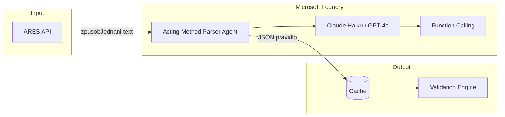

# Acting Method Parser - Microsoft Foundry Implementation

> **Status**: 📋 RESEARCH
> **Created**: 2026-01-26
> **Purpose**: Jak postavit Acting Method Parser agenta pomocí Microsoft Foundry

---

## 1. Proč Microsoft Foundry

Microsoft Foundry nabízí:

- **Claude modely** (Sonnet, Opus, Haiku) přímo v Azure - jediný cloud s OpenAI i Anthropic
- **Foundry Agent Service** - managed runtime pro agenty
- **Enterprise-grade bezpečnost** - Microsoft Entra, RBAC, content filters
- **Observability** - Application Insights integrace

---

## 2. Architektura v Foundry



---

## 3. Komponenty agenta

### 3.1 Model

| Model | Použití | Cena |
|-------|---------|------|
| **Claude Haiku** | Produkce (rychlý, levný) | ~$0.0001/parse |
| **GPT-4o-mini** | Alternativa | Podobná |
| **Claude Sonnet** | Komplexní případy | Vyšší |

### 3.2 Instructions (System Prompt)

```markdown
# Acting Method Parser Agent

Jsi specializovaný parser pro české "způsob jednání" texty.

## Úkol
Převeď vstupní text na strukturované JSON pravidlo.

## Výstup
{
  "canActAlone": boolean,
  "actorType": "any_director" | "chairman_only" | "specific_role",
  "jointAction": { "minimumActors": number } | null,
  "procuratorCanSign": boolean,
  "confidence": 0.0-1.0
}

## Slovník
- samostatně/sám → canActAlone: true
- společně/ve dvou → canActAlone: false
- jednatel → director
- předseda → chairman
- prokurista → procurator
```

### 3.3 Tools (Function Calling)

Agent nepotřebuje externí nástroje - pouze vrací strukturovaný JSON.
Volitelně lze přidat:

| Tool | Účel |
|------|------|
| `validate_schema` | Ověří JSON výstup |
| `cache_lookup` | Zkontroluje cache před parsováním |
| `log_result` | Uloží výsledek pro audit |

---

## 4. Implementace

### 4.1 Python SDK

```python
from azure.ai.projects import AIProjectClient
from azure.identity import DefaultAzureCredential

# Připojení k Foundry
client = AIProjectClient(
    credential=DefaultAzureCredential(),
    project_name="securedeal-agents"
)

# Vytvoření agenta
agent = client.agents.create(
    name="acting-method-parser",
    model="claude-haiku",
    instructions=SYSTEM_PROMPT,
    response_format={"type": "json_object"}
)

# Parsování
def parse_acting_method(zpusob_jednani: str) -> dict:
    thread = client.agents.threads.create()

    client.agents.messages.create(
        thread_id=thread.id,
        role="user",
        content=zpusob_jednani
    )

    run = client.agents.runs.create_and_wait(
        thread_id=thread.id,
        agent_id=agent.id
    )

    messages = client.agents.messages.list(thread_id=thread.id)
    return json.loads(messages[-1].content)
```

### 4.2 Edge Function integrace

```typescript
// supabase/functions/parse-acting-method/index.ts
import { createClient } from "@azure/ai-projects";

const client = createClient({
  endpoint: Deno.env.get("FOUNDRY_ENDPOINT"),
  credential: { key: Deno.env.get("FOUNDRY_KEY") }
});

export async function parseActingMethod(zpusobJednani: string) {
  // Check cache first
  const cached = await checkCache(zpusobJednani);
  if (cached) return cached;

  // Call Foundry agent
  const result = await client.agents.complete({
    agent: "acting-method-parser",
    messages: [{ role: "user", content: zpusobJednani }]
  });

  // Cache & return
  await saveToCache(zpusobJednani, result);
  return result;
}
```

---

## 5. Foundry Agent Service výhody

| Feature | Přínos pro nás |
|---------|----------------|
| **Managed runtime** | Žádná infrastruktura k údržbě |
| **Content filters** | Ochrana proti prompt injection |
| **Observability** | Logy a traces v Application Insights |
| **Conversation state** | Automatická správa kontextu |
| **RBAC** | Řízení přístupu k agentovi |
| **Multi-model** | Můžeme přepínat mezi Claude/GPT |

---

## 6. Bezpečnost

```
┌─────────────────────────────────────────────┐
│           Microsoft Foundry                  │
├─────────────────────────────────────────────┤
│  ✓ Microsoft Entra (identity)               │
│  ✓ RBAC (role-based access)                 │
│  ✓ Content filters (prompt injection)       │
│  ✓ Audit logs                               │
│  ✓ Network isolation (VNET)                 │
│  ✓ Data encryption                          │
└─────────────────────────────────────────────┘
```

---

## 7. Náklady

| Položka | Odhad/měsíc |
|---------|-------------|
| Claude Haiku API | ~$10-50 |
| Foundry Agent Service | Dle usage |
| Cache (Cosmos DB) | ~$5-10 |
| **Celkem** | ~$20-70 |

*Cache hit rate ~95% výrazně snižuje API náklady*

---

## 8. Kroky k implementaci

### Fáze 1: Setup (1 den)
- [ ] Vytvořit Azure Foundry resource
- [ ] Nasadit Claude Haiku model
- [ ] Nakonfigurovat projekt

### Fáze 2: Agent (2 dny)
- [ ] Definovat system prompt
- [ ] Vytvořit agenta přes SDK
- [ ] Testovat na vzorových datech

### Fáze 3: Integrace (2 dny)
- [ ] Edge Function wrapper
- [ ] Cache layer (Cosmos DB / Supabase)
- [ ] Napojit na validation engine

### Fáze 4: Produkce (1 den)
- [ ] Monitoring (Application Insights)
- [ ] Alerting na nízkou confidence
- [ ] Human review queue

---

## 9. Alternativy

| Platforma | Pro | Proti |
|-----------|-----|-------|
| **Microsoft Foundry** | Enterprise-ready, Claude + GPT | Azure vendor lock |
| **Anthropic API přímo** | Nejnovější Claude | Bez managed runtime |
| **OpenAI Assistants** | Podobná funkcionalita | Jen OpenAI modely |
| **Custom (Supabase Edge)** | Plná kontrola | Více práce |

---

## Zdroje

- [Microsoft Foundry Overview](https://azure.microsoft.com/en-us/products/ai-foundry)
- [Foundry Agent Service](https://learn.microsoft.com/en-us/azure/ai-foundry/agents/overview)
- [Build Your First Agent Workshop](https://microsoft.github.io/build-your-first-agent-with-azure-ai-agent-service-workshop/)
- [Microsoft Agent Framework](https://azure.microsoft.com/en-us/blog/introducing-microsoft-agent-framework/)

---

*Vytvořeno: 2026-01-26*
