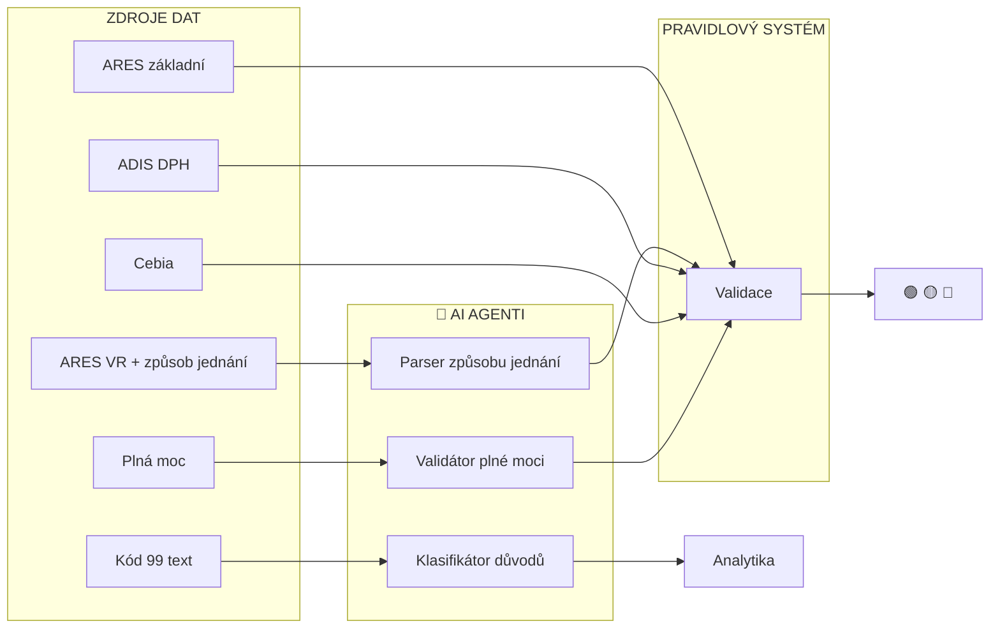

# SecureDeal AI - Kde využijeme AI agenty

## Klíčový princip

AI agenti **nenahrazují** naši validační logiku.
AI agenti **převádějí nestrukturovaná data** do strukturované podoby, kterou pak zpracuje náš pravidlový systém.

---

## Přehled: Kde jednotliví agenti zapadají do procesu



> **Legenda:** 🤖 = AI agent převádí nestrukturovaný text na data

---

## Vysvětlení jednotlivých případů použití

### 🤖 Agent č.1: Parser způsobu jednání (VYSOKÁ PRIORITA)

**Problém:** ARES vrací právní text popisující, jak jednatelé mohou podepisovat smlouvy:
> *"Společnost zastupují vždy 2 (dva) jednatelé společně."*

**Řešení:** AI převede text na strukturované pravidlo:
```
{ "můžeJednatSám": ne, "minimálníPočetPodepisujících": 2 }
```

**Přínos:** Zabraňuje uzavření neplatných smluv.

---

### 🤖 Agent č.2: Klasifikátor důvodů pozastavení (STŘEDNÍ PRIORITA)

**Problém:** 35% pozastavení plateb používá kód 99 ("Jiné") s volným textem:
> *"Čekáme na potvrzení od leasingové společnosti o ukončení smlouvy"*

**Řešení:** AI klasifikuje text do standardní kategorie (např. "Leasingová dokumentace").

**Přínos:** Zlepšuje výkaznictví a analytiku.

---

### 🤖 Agent č.3: Validátor plné moci (STŘEDNÍ PRIORITA)

**Problém:** Dokumenty plné moci nemají standardní formát a vyžadují manuální kontrolu.

**Řešení:** AI extrahuje strukturovaná data ze skenu:
```
{ "zmocnitel": "Jan Novák", "zmocněnec": "Marie Svobodová", "VIN": "..." }
```

**Přínos:** Automatizuje revizi plných mocí.

---

## Zlaté pravidlo

| Úloha | Použít AI? |
|-------|------------|
| Zpracovat nestrukturovaný text | ✅ Ano |
| Extrahovat data z dokumentů | ✅ Ano |
| Rozhodovat o schválení/zamítnutí | ❌ Ne (pravidlový systém) |
| Určit ZELENÁ/ORANŽOVÁ/ČERVENÁ | ❌ Ne (deterministická logika) |

---

*AI agenti zpracovávají práci, kterou dnes dělají lidé ručně.
Všechna kritická rozhodnutí zůstávají založena na pravidlech a jsou auditovatelná.*
